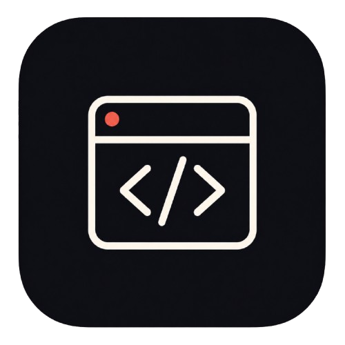

# code-tape 录码带

    

## 完成度优先

> [规范工作流程](docs/规范工作流程.md)
| [技术模块拆解](docs/技术模块拆解.md)
| [项目时间规划](docs/项目时间规划.md)
| [知识库](docs/知识库契约.md)

> [竞品分析](docs/竞品分析)
-> [技术方案](docs/技术方案.md)

[各位同学当前进度](docs/progress.md)

## Harness 循环

- GitHub Actions
    - 通过 issues 和 PR 自动算分工作流，调度仓库开发走向
        - 使用 [progress-reporter](skills/progress-reporter) 技能、通过飞书智能体 [FrontAgent](https://github.com/ceilf6/FrontAgent) 定时在群内通知进度
    - 使用 [repo-guard](https://github.com/ceilf6/repo-guard) 对 issues 和 PR 进行质量检测、并通过工程提示词要求开发代理审批守卫评论、做出反应
        - 其中 CR 技能来自 [ceilf6-skills](https://github.com/ceilf6/ceilf6-skills/tree/main/code-reviewer)
- Git hooks
    - `pre-commit` 运行 `npm run quality:precommit`，提交前覆盖仓库测试、Web lint、Web 单测和构建
    - `pre-push` 运行 `npm run quality:local`，推送前刷新 GitNexus 索引并执行完整本地质量闸门
- 知识库
    - 通过 GitNexus 观测代码的级联反应，进行 CICD 把控
    - ~~使用 OpenViking 为 Agent 提供仓库的渐进式上下文~~
        - 由于需要挂载服务，背离了本项目当前敏捷开发的需求，暂时清除

## 决策记录

- [ADR-001: P0 代码执行路线采用 iframe sandbox 前端展示](https://github.com/ceilf6/code-tape/discussions/20)
- [ADR-002: P0 TypeScript 必达编辑回放，简单运行作为可选 PoC](https://github.com/ceilf6/code-tape/discussions/21)
- [ADR-003: P0 录制包使用 IndexedDB，本地文件导出作为保存兜底](https://github.com/ceilf6/code-tape/discussions/22)
- [ADR-004: P0 音视频使用单 WebM 轨，录制前选择设备](https://github.com/ceilf6/code-tape/discussions/23)
- [ADR-005: Python 仅作为 P0 可选加分，不阻塞主链路](https://github.com/ceilf6/code-tape/discussions/24)
- [ADR-006: 前端框架采用 Vite + React + TypeScript](https://github.com/ceilf6/code-tape/discussions/25)
- [ADR-007: 编辑器采用 Monaco Editor](https://github.com/ceilf6/code-tape/discussions/26)
- [ADR-008: 状态管理优先 React hooks 与 reducer](https://github.com/ceilf6/code-tape/discussions/27)
- [ADR-009: UI 采用工具型工作台，P0 默认深色](https://github.com/ceilf6/code-tape/discussions/28)
- [ADR-010: P0 内容变更事件保存完整代码快照](https://github.com/ceilf6/code-tape/discussions/29)
- [ADR-011: seek 采用 inclusive 快照加增量事件静默重放](https://github.com/ceilf6/code-tape/discussions/30)
- [ADR-012: 测试栈采用 Vitest、Testing Library 与 Playwright](https://github.com/ceilf6/code-tape/discussions/31)
- [ADR-013: 回放展示历史运行结果，不默认重新执行代码](https://github.com/ceilf6/code-tape/discussions/32)
- [ADR-014: WebContainers 延后到 P1 PoC](https://github.com/ceilf6/code-tape/discussions/33)
- [ADR-015: 后端 Docker 沙箱延后](https://github.com/ceilf6/code-tape/discussions/34)
- [ADR-016: 终端录制延后](https://github.com/ceilf6/code-tape/discussions/35)
- [ADR-017: 多文件工程运行延后](https://github.com/ceilf6/code-tape/discussions/36)
- [ADR-018: WebRTC 实时面试延后到 P1+](https://github.com/ceilf6/code-tape/discussions/37)
- [ADR-019: AI 字幕延后到 P1+ 并分级实现](https://github.com/ceilf6/code-tape/discussions/38)
- [ADR-020: 账号权限与云端分享延后到 P1](https://github.com/ceilf6/code-tape/discussions/39)
- [ADR-021: 录制包必须包含 manifest、checksum、校验和迁移入口](https://github.com/ceilf6/code-tape/discussions/48)
- [ADR-022: P0 暂停期间锁定影响回放状态的输入](https://github.com/ceilf6/code-tape/discussions/49)
- [ADR-023: 回放媒体通过 MediaClockAdapter 映射到事实时间轴](https://github.com/ceilf6/code-tape/discussions/50)
- [ADR-024: iframe runtime 必须校验 source、runId、消息 schema 并设置超时](https://github.com/ceilf6/code-tape/discussions/51)
- [ADR-025: P0 主演示环境锁定桌面 Chrome/Edge latest 并设量化预算](https://github.com/ceilf6/code-tape/discussions/52)
- [ADR-026: 开发模式采用 Google Chunk 小粒度主干协作](https://github.com/ceilf6/code-tape/discussions/70)
