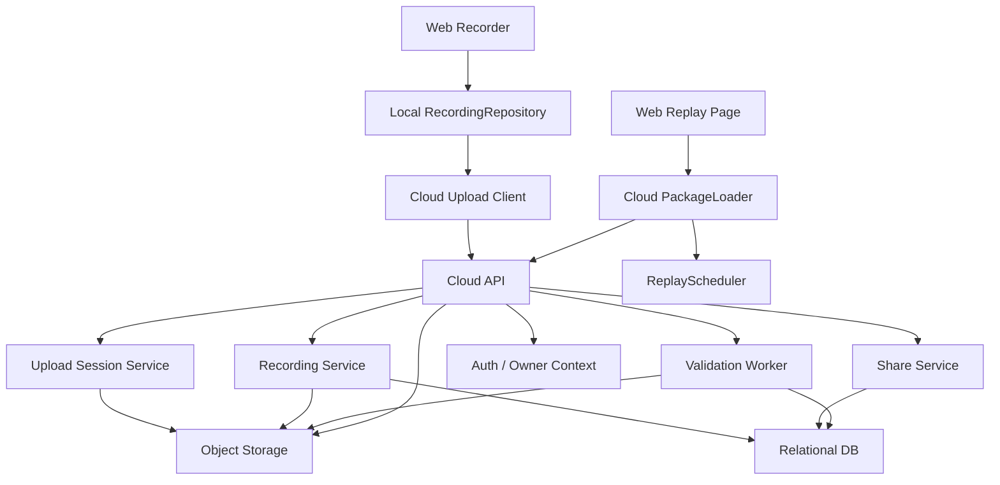
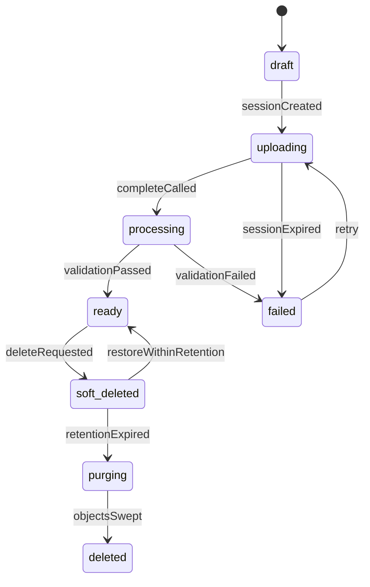
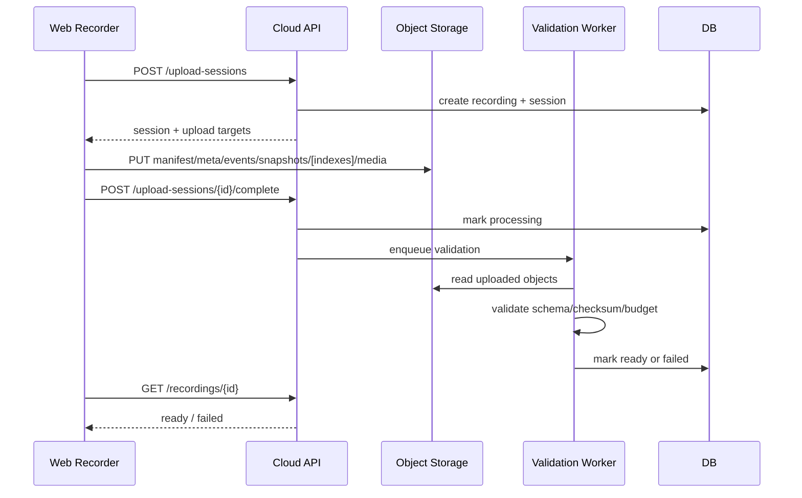

# 代码讲解工具云端技术方案

> **阅读摘要**
>
> 本文基于 `docs/PRD.md` 与 `docs/技术方案.md`，细化 code-tape 的 P1 云端能力设计。PRD 明确 P1 需要“云端回放中心”，支持录制完成后上传至后端、列表查看、在线播放、删除、重命名；`docs/技术方案.md` 明确 P0 仍以本地 IndexedDB 与文件导出为主，云端上传放到 P1。本文不改变 P0 范围，不把账号体系、云端权限、团队分享、后端沙箱、WebRTC 或 AI 字幕提前纳入 P0 必达能力。

## 一、依据、目标与边界

### 1. 文档优先级

本方案只负责补足云端侧细节。若出现冲突，按以下优先级处理：

1. `docs/PRD.md`：最高权威，决定 P0/P1/P1+ 产品范围。
2. `docs/技术方案.md`：决定当前整体技术路线、事件模型、录制包 schema、P0 非目标与 P1 扩展方向。
3. 本文：在不改变上述两份文档的前提下，细化 P1 云端架构、接口、存储、安全与验收方案。

### 2. P1 云端目标

P1 云端回放中心必须完成：

- 录制完成后可从本地录制包上传到云端。
- 云端保存录制记录，包含标题、时长、录制时间、语言、音视频能力等列表字段。
- 支持云端录制列表查看。
- 支持在线播放云端录制，复用 P0 回放调度器和事件时间轴。
- 支持重命名。
- 支持删除。
- 支持时间点分享链接，至少支持 `?t=42000` 定位。
- 服务端校验 schema、duration、checksum、媒体大小，拒绝损坏或超预算录制包。

### 3. P1 可选增强

以下能力可以和云端回放中心共享基础设施，但不阻塞 P1 云端主验收：

- 活动索引：编辑、运行、错误、快捷键、静默段。
- 缩略图与列表预览。
- 观看者暂停后临时编辑和 fork。
- WebContainers PoC 或后端沙箱 PoC。
- 更细粒度分享权限、访问统计、批注评论。

### 4. P1+ 与更远期能力

以下能力只在主链路稳定后接入：

- WebRTC 实时面试：需要信令、房间、实时事件同步和音视频通话。
- AI 字幕：需要音频转写任务、字幕文件存储、术语纠错和章节生成。
- 团队空间、课程/题目组织、评论批注、审计和管理后台。

### 5. 明确非目标

- 不将云端上传作为 P0 保存的唯一出口；P0 本地 IndexedDB 和文件导出仍是主路径。
- 不在云端回放时重新执行用户历史代码；回放继续以录制包中的事件、快照、运行结果和 preview snapshot 为事实源。
- 不把完整后端代码沙箱纳入云端回放中心的必需依赖；后端沙箱是独立 P1 PoC 或 P1+ 强化项。
- 不默认公开所有录制；分享链接和公开策略必须显式建模。
- 不把对象存储中的媒体文件直接公开为永久 URL；对外访问通过短期签名 URL 或受控 CDN。

### 6. 待确认问题

以下问题不应在实现时隐式决定，需要产品或仓库维护者确认：

| 问题         | 默认建议                                                                                    | 不确认的风险                           |
| ------------ | ------------------------------------------------------------------------------------------- | -------------------------------------- |
| 登录体系     | P1 若已有企业登录，则 `ownerId` 绑定登录用户；若没有，先用本地设备 owner token 做 Demo 隔离 | 影响“我的录制”列表、删除权限和分享权限 |
| 云厂商       | 使用 S3 兼容对象存储抽象，避免绑定具体厂商                                                  | 影响 SDK、回调鉴权、CDN 和成本模型     |
| 分享可见性   | P1 默认 `private`，显式创建 `unlisted` 分享链接                                             | 误把个人录制暴露给所有人               |
| 单次上传上限 | 沿用 P0 预算：15 分钟、20,000 事件、媒体 200MB；P1 可按真实成本调整                         | 超大包会拖垮上传、校验和回放加载       |
| 删除保留期   | 默认软删 7 天后清理对象存储                                                                 | 影响误删恢复、存储成本和隐私诉求       |

## 二、核心架构判断

### 1. 本地录制包仍是事实源

P1 云端不是重新定义录制格式，而是接收 P0 生成的 `RecordingPackageV1`：

- `events`、`snapshots`、`meta`、`manifest` 继续使用现有 schema，`indexes` 作为可选派生索引复用现有结构。
- 媒体仍以 WebM Blob 作为同步轨道。
- `timestampMs` 和 `seq` 继续作为回放事实顺序。
- 服务端只做校验、存储、索引和分发，不修改录制事实。

这样能保证“本地回放”和“云端回放”使用同一套 `PackageLoader`、`ReplayIndex`、`ReplayScheduler` 和 `ReplayReducer`。

### 2. 元数据进数据库，大文件进对象存储

云端数据分两类：

| 类型                                                         | 存储位置     | 说明                                           |
| ------------------------------------------------------------ | ------------ | ---------------------------------------------- |
| 列表、权限、状态、分享、审计                                 | 关系型数据库 | 需要筛选、分页、事务、权限判断                 |
| manifest、meta、events、snapshots、indexes、media、thumbnail | 对象存储     | 文件体积大，适合 CDN、Range 请求和生命周期管理 |

数据库只保存对象 key、checksum、size、mimeType、schemaVersion 等索引信息，不把大 JSON 和 WebM 直接塞进业务表。

### 3. 上传使用 session，两阶段完成

本地保存流程已经采用 `draft -> complete` 的两阶段思路。云端延续这个模型：

1. 创建 upload session，服务端生成 `recordingId` 和各资产上传目标。
2. 前端上传 JSON 与 media Blob。
3. 前端调用 complete。
4. 服务端校验完整性，通过后把录制状态切为 `ready`。
5. 校验失败则切为 `failed`，保留错误原因并允许用户重试或删除。

列表页只展示 `ready` 状态录制，避免半成品进入回放中心。

### 4. 回放走受控加载，不暴露存储细节

云端播放页不直接拼对象存储 URL，而是通过 API 获取播放描述：

- `manifest`、`meta` 可直接由 API 返回或签名下载；`indexes` 有可用资产时签名下载，缺失时由服务端或前端重建。
- `events`、`snapshots` 可按完整文件下载，后续大包再扩展分片加载。
- `media` 使用短期签名 URL，支持浏览器媒体元素加载和 Range 请求。

回放层只关心 `PackageLoadResult`，不感知资产来自 IndexedDB、zip 文件还是云端。

### 5. 后端代码执行独立成服务

PRD 的 P1 包含后端代码执行安全增强，但它不应耦合云端回放中心：

- 云端回放中心负责录制包上传、存储、分发和权限。
- 代码执行服务负责接收当前代码、执行、返回 stdout/stderr/error。
- 历史回放仍展示录制时保存的运行结果，不调用代码执行服务重跑。

两者可以共享登录和审计，但部署、限流、沙箱权限、风险等级必须分开。

## 三、总体架构

### 1. 架构图



### 2. 模块职责

| 模块                   | 职责                                            | 关键约束                          |
| ---------------------- | ----------------------------------------------- | --------------------------------- |
| Cloud Upload Client    | 把本地录制包上传到云端，处理重试、进度、错误    | 不直接绕过 API 写业务状态         |
| Cloud PackageLoader    | 加载云端录制资产，转换成 `PackageLoadResult`    | 复用 P0 校验、迁移、checksum 逻辑 |
| Recording API          | 列表、详情、重命名、删除、播放描述              | 所有读写都做 owner/share 权限判断 |
| Upload Session Service | 创建上传会话、签名上传 URL、幂等 complete       | 防止半成品进入 `ready`            |
| Validation Worker      | 校验 schema、checksum、duration、size、mimeType | 失败必须落错误码，可排查          |
| Share Service          | 生成、撤销、解析分享链接                        | token 不可预测，支持过期时间      |
| Object Storage         | 保存录制资产与媒体 Blob                         | 不公开 bucket，依赖签名 URL       |
| Relational DB          | 保存录制元数据、状态、权限、分享、资产索引      | 事务更新状态                      |

### 3. 部署形态

P1 推荐使用三层部署：

| 层             | 推荐形态                      | 说明                                         |
| -------------- | ----------------------------- | -------------------------------------------- |
| Web            | 静态资源托管 + CDN            | 继续服务 `apps/web` 构建产物                 |
| API            | Node.js 20 HTTP 服务          | 贴近现有 TypeScript 栈，便于复用 schema 类型 |
| Worker         | Node.js 后台任务进程          | 处理校验、索引补全、缩略图等异步任务         |
| DB             | PostgreSQL 或兼容关系型数据库 | P1 需要分页、权限、状态事务                  |
| Object Storage | S3 兼容对象存储               | 支持签名 URL、Range、生命周期                |

本地开发可用 SQLite + MinIO 或文件系统对象存储模拟，但接口层仍按云端抽象实现。

## 四、领域模型

### 1. Recording 状态机



状态说明：

| 状态           | 是否进列表         | 是否可播放 | 说明                                                    |
| -------------- | ------------------ | ---------- | ------------------------------------------------------- |
| `draft`        | 否                 | 否         | 只创建了数据库记录                                      |
| `uploading`    | 否                 | 否         | 前端正在上传资产                                        |
| `processing`   | 否                 | 否         | 服务端校验和索引处理中                                  |
| `ready`        | 是                 | 是         | 完整可播放                                              |
| `failed`       | 可在上传结果页展示 | 否         | 校验失败、超限、缺资产或 session 过期                   |
| `soft_deleted` | 否                 | 否         | 软删状态，列表和播放不可见，对象保留到 `deletedAt + 7d` |
| `purging`      | 否                 | 否         | 保留期结束，正在清理对象存储资产和派生数据              |
| `deleted`      | 否                 | 否         | 对象清理完成，仅保留必要审计记录                        |

### 2. 核心实体

```ts
export type CloudRecordingStatus =
  | "draft"
  | "uploading"
  | "processing"
  | "ready"
  | "failed"
  | "soft_deleted"
  | "purging"
  | "deleted";

export type RecordingVisibility = "private" | "unlisted";

export type CloudRecording = {
  id: string;
  ownerId: string | null;
  title: string;
  schemaVersion: string;
  status: CloudRecordingStatus;
  visibility: RecordingVisibility;
  createdAt: string;
  updatedAt: string;
  completedAt: string | null;
  deletedAt: string | null;
  purgedAt: string | null;
  durationMs: number;
  initialLanguage: "javascript" | "typescript" | "python";
  hasAudio: boolean;
  hasCamera: boolean;
  mediaSizeBytes: number;
  totalSizeBytes: number;
  eventCount: number;
  snapshotCount: number;
  failureCode: string | null;
  failureMessage: string | null;
};

export type RecordingAssetKind =
  | "manifest"
  | "meta"
  | "events"
  | "snapshots"
  | "indexes"
  | "media"
  | "thumbnail";

export type RecordingAsset = {
  id: string;
  recordingId: string;
  kind: RecordingAssetKind;
  objectKey: string;
  sha256: string;
  sizeBytes: number;
  mimeType: string;
  uploadedAt: string | null;
  validatedAt: string | null;
};

export type UploadSession = {
  id: string;
  recordingId: string;
  ownerId: string | null;
  status: "open" | "completed" | "expired" | "failed";
  expiresAt: string;
  expectedAssets: RecordingAssetKind[];
  idempotencyKey: string;
  createdAt: string;
  completedAt: string | null;
};

export type RecordingShareLink = {
  id: string;
  recordingId: string;
  tokenHash: string;
  createdBy: string | null;
  createdAt: string;
  expiresAt: string | null;
  revokedAt: string | null;
};
```

### 3. 数据库表建议

#### `recordings`

| 字段               | 类型              | 说明                                                                   |
| ------------------ | ----------------- | ---------------------------------------------------------------------- |
| `id`               | string / uuid     | 云端录制 id，和本地 package id 可不同                                  |
| `owner_id`         | string nullable   | 登录用户 id；未接登录时为本地 owner token 对应 id                      |
| `title`            | string            | 录制标题                                                               |
| `schema_version`   | string            | 例如 `0.1.0`                                                           |
| `status`           | enum              | `draft/uploading/processing/ready/failed/soft_deleted/purging/deleted` |
| `visibility`       | enum              | `private/unlisted`                                                     |
| `created_at`       | datetime          | 创建时间                                                               |
| `updated_at`       | datetime          | 更新时间                                                               |
| `completed_at`     | datetime nullable | 校验完成时间                                                           |
| `deleted_at`       | datetime nullable | 软删时间；到 `deleted_at + 7d` 后才允许清理对象资产                    |
| `purged_at`        | datetime nullable | 对象资产清理完成时间                                                   |
| `duration_ms`      | int               | 录制有效时长                                                           |
| `initial_language` | string            | 初始语言                                                               |
| `has_audio`        | boolean           | 是否有音频                                                             |
| `has_camera`       | boolean           | 是否有摄像头                                                           |
| `media_size_bytes` | bigint            | 媒体大小                                                               |
| `total_size_bytes` | bigint            | 所有资产总大小                                                         |
| `event_count`      | int               | 事件数量                                                               |
| `snapshot_count`   | int               | 快照数量                                                               |
| `failure_code`     | string nullable   | 失败编码                                                               |
| `failure_message`  | string nullable   | 失败信息                                                               |

索引：

- `(owner_id, status, created_at desc)`：我的录制列表。
- `(status, updated_at)`：清理过期上传和删除任务。
- `(visibility, status)`：分享解析后的播放检查。

#### `recording_assets`

| 字段           | 类型              | 说明                                                   |
| -------------- | ----------------- | ------------------------------------------------------ |
| `id`           | string / uuid     | 资产 id                                                |
| `recording_id` | string            | 所属录制                                               |
| `kind`         | enum              | manifest/meta/events/snapshots/indexes/media/thumbnail |
| `object_key`   | string            | 对象存储 key                                           |
| `sha256`       | string            | 内容校验                                               |
| `size_bytes`   | bigint            | 文件大小                                               |
| `mime_type`    | string            | MIME                                                   |
| `uploaded_at`  | datetime nullable | 上传完成时间                                           |
| `validated_at` | datetime nullable | 校验通过时间                                           |

唯一约束：

- `(recording_id, kind)` 唯一。若未来支持分片或多媒体段，再扩展 `part_no` 或 `segment_no`。

#### `upload_sessions`

| 字段              | 类型              | 说明                          |
| ----------------- | ----------------- | ----------------------------- |
| `id`              | string / uuid     | session id                    |
| `recording_id`    | string            | 对应录制                      |
| `owner_id`        | string nullable   | 上传者                        |
| `status`          | enum              | open/completed/expired/failed |
| `expires_at`      | datetime          | 过期时间                      |
| `expected_assets` | json              | 预期上传资产                  |
| `idempotency_key` | string            | 幂等 key                      |
| `created_at`      | datetime          | 创建时间                      |
| `completed_at`    | datetime nullable | complete 时间                 |

唯一约束：

- `(owner_id, idempotency_key)` 唯一，用于断网重试时复用同一个 session。

#### `recording_share_links`

| 字段           | 类型              | 说明                              |
| -------------- | ----------------- | --------------------------------- |
| `id`           | string / uuid     | 分享记录 id                       |
| `recording_id` | string            | 所属录制                          |
| `token_hash`   | string            | 分享 token 的哈希，数据库不存明文 |
| `created_by`   | string nullable   | 创建者                            |
| `created_at`   | datetime          | 创建时间                          |
| `expires_at`   | datetime nullable | 过期时间                          |
| `revoked_at`   | datetime nullable | 撤销时间                          |

索引：

- `token_hash` 唯一索引。
- `(recording_id, revoked_at)` 用于管理录制的分享链接。

## 五、对象存储设计

### 1. 对象 key 规范

```text
recordings/
  {recordingId}/
    package/
      manifest.json
      meta.json
      events.json
      snapshots.json
      indexes.json
    media/
      media.webm
    thumbnails/
      poster.webp
```

后续如果支持分片大包或分段媒体，可以扩展为：

```text
recordings/{recordingId}/package/events/part-0001.jsonl
recordings/{recordingId}/media/segment-0001.webm
```

P1 先不引入分片事件文件，保持和 P0 zip 结构一致，降低 loader 复杂度。

### 2. Content-Type 与缓存

| 资产             | Content-Type       | 缓存策略                                      |
| ---------------- | ------------------ | --------------------------------------------- |
| `manifest.json`  | `application/json` | 短缓存，便于状态和迁移                        |
| `meta.json`      | `application/json` | 可长缓存，录制 ready 后不可变                 |
| `events.json`    | `application/json` | 可长缓存，录制 ready 后不可变                 |
| `snapshots.json` | `application/json` | 可长缓存，录制 ready 后不可变                 |
| `indexes.json`   | `application/json` | 可选派生资产；可长缓存，可通过版本化 key 更新 |
| `media.webm`     | `video/webm`       | 可长缓存，必须支持 Range                      |
| `poster.webp`    | `image/webp`       | 可长缓存                                      |

录制一旦进入 `ready`，包资产应视为不可变。重命名只改数据库 `title`，不重写 `meta.json`，除非后续明确要导出云端更新后的完整包。

### 3. Checksum 与对象元信息

每个对象上传后都要保存：

- `sha256`
- `sizeBytes`
- `mimeType`
- `uploadedAt`
- `validatedAt`

服务端 complete 时需要同时校验：

- 前端声明的 checksum。
- 对象存储实际对象大小。
- `manifest.checksums` 中的 JSON 和 media checksum。
- `RecordingMedia.sizeBytes` 与对象大小。

校验不通过时，录制状态进入 `failed`，不允许播放。

## 六、核心流程

### 1. 上传流程



关键规则：

- 前端必须先完成本地 `RecordingPackageV1` 构建和本地校验，再发起上传。
- `upload-sessions` 创建时必须带 `idempotencyKey`，避免刷新或重试生成多个半成品。
- JSON 资产可以走 API 直传或对象存储签名上传；媒体必须走对象存储签名上传，避免 API 内存压力。
- complete 后 session 不再接受新对象；如果需要重传，创建新 session 或让后端生成 retry upload target。
- Worker 校验通过前，录制不进入云端列表。

### 2. 上传失败与重试

| 失败点               | 用户可见状态 | 重试策略                               |
| -------------------- | ------------ | -------------------------------------- |
| 创建 session 失败    | 上传未开始   | 直接重试                               |
| JSON 上传失败        | 上传失败     | 保持本地包，重新上传失败资产           |
| media 上传失败       | 上传失败     | 支持从 media 资产继续重传              |
| complete 失败        | 上传待确认   | 查询 session 状态，幂等重试 complete   |
| schema/checksum 失败 | 云端校验失败 | 展示错误，用户可重新从本地包发起新上传 |
| session 过期         | 上传过期     | 创建新 session，旧半成品由清理任务删除 |

P1 不要求断点续传大媒体，但接口设计需要允许未来扩展 multipart upload。

### 3. 云端列表流程

列表页请求：

```text
GET /api/recordings?status=ready&cursor=...&limit=20
```

返回字段只包含列表所需信息：

- `id`
- `title`
- `createdAt`
- `durationMs`
- `initialLanguage`
- `hasAudio`
- `hasCamera`
- `thumbnailUrl`
- `visibility`
- `updatedAt`

排序默认 `createdAt desc`。P1 先只做“我的录制”，不做团队空间筛选。

### 4. 在线播放流程

播放页进入：

```text
/replays/:id
/replays/:id?t=42000
```

加载步骤：

1. 前端请求 `GET /api/recordings/:id/playback`。
2. 服务端校验 owner 或 share 权限。
3. 返回 package 描述和短期签名 URL。
4. `CloudPackageLoader` 下载 `manifest`、`meta`、`events`、`snapshots`；若 `indexesUrl` 非空则下载 `indexes`，否则从 `events/snapshots` 重建 `ReplayIndex`。
5. 执行 `validateRecordingPackageV1()`、`migrateRecordingPackage()`、checksum 校验。
6. 初始化 `ReplayIndex` 和 `ReplayScheduler`。
7. 若 URL 带 `t`，调用唯一入口 `seek(targetTimeMs)`。
8. 媒体 URL 交给 `MediaClockAdapter`，继续使用 250ms drift 阈值。

播放描述示例：

```ts
export type CloudPlaybackDescriptor = {
  recording: {
    id: string;
    title: string;
    durationMs: number;
    schemaVersion: string;
  };
  assets: {
    manifestUrl: string;
    metaUrl: string;
    eventsUrl: string;
    snapshotsUrl: string;
    indexesUrl: string | null;
    mediaUrl: string | null;
    thumbnailUrl: string | null;
  };
  expiresAt: string;
};
```

如果媒体缺失但事件包完整，回放页应降级为纯事件流回放，并展示“该云端录制缺少音视频轨”的提示。

### 5. 重命名流程

```text
PATCH /api/recordings/:id
```

请求：

```ts
export type UpdateRecordingRequest = {
  title?: string;
};
```

规则：

- 只有 owner 可以重命名。
- 标题必须 trim，长度建议 1 到 80 个字符。
- 重命名只更新数据库，不重写对象存储中的 `meta.json`。
- 若后续支持重新导出云端 zip，导出时由服务端把数据库标题覆盖到导出包 meta。

### 6. 删除流程

```text
DELETE /api/recordings/:id
```

规则：

- 只有 owner 可以删除。
- API 先把状态置为 `soft_deleted`，写入 `deletedAt`，并立即从列表和播放隐藏。
- 删除时同步撤销分享访问；已有分享链接解析为失效，不再换取播放资产 URL。
- `soft_deleted` 保留对象存储资产 7 天，保留期内可以由内部恢复能力把状态切回 `ready`。
- `deletedAt + 7d` 后清理任务把状态切为 `purging`，再异步删除对象存储资产、分享链接和派生缩略图。
- 对象清理完成后状态置为 `deleted`，只保留必要审计记录；若对象存储删除失败，保留 `purging` 状态并重试。

P1 默认采用 7 天软删保留模型。是否提供恢复 UI 由产品确认；即使不做恢复 UI，服务端状态机也按软删保留期执行，避免误删后对象立即不可恢复。

### 7. 分享链接流程

创建分享：

```text
POST /api/recordings/:id/share-links
```

请求：

```ts
export type CreateShareLinkRequest = {
  expiresAt?: string | null;
  startTimeMs?: number;
};
```

响应：

```ts
export type CreateShareLinkResponse = {
  url: string; // /s/{token}?t=42000
  expiresAt: string | null;
};
```

规则：

- 分享 token 至少 128 bit 随机熵。
- 数据库存 token hash，不存明文 token。
- 分享链接默认 `unlisted`：知道链接的人可看，不进公开搜索。
- owner 可撤销分享链接。
- 分享播放仍通过 `GET /api/share/:token/playback` 换取短期播放资产 URL。

## 七、API 契约

### 1. 创建上传会话

```text
POST /api/recordings/upload-sessions
```

请求：

```ts
export type CreateUploadSessionRequest = {
  idempotencyKey: string;
  localPackageId: string;
  title: string;
  schemaVersion: string;
  durationMs: number;
  initialLanguage: "javascript" | "typescript" | "python";
  hasAudio: boolean;
  hasCamera: boolean;
  assets: Array<{
    kind: RecordingAssetKind;
    sha256: string;
    sizeBytes: number;
    mimeType: string;
  }>;
};
```

响应：

```ts
export type CreateUploadSessionResponse = {
  sessionId: string;
  recordingId: string;
  expiresAt: string;
  uploadTargets: Array<{
    kind: RecordingAssetKind;
    method: "PUT";
    url: string;
    headers: Record<string, string>;
    maxSizeBytes: number;
  }>;
};

export type UploadTarget = CreateUploadSessionResponse["uploadTargets"][number];
```

校验：

- `schemaVersion` 必须被当前服务端支持，或存在 migration。
- `durationMs` 不超过 P1 上限。
- 必需资产：`manifest`、`meta`、`events`、`snapshots`。
- 可选资产：`indexes`、`media`、`thumbnail`；`indexes` 缺失时不拒绝上传，由 Worker 重建并尽量写回对象存储。
- `media` 可为空；为空时 `hasAudio/hasCamera` 必须为 false 或由服务端记录 warning。
- 单个资产和总资产大小不超过配额。

### 2. 完成上传

```text
POST /api/recordings/upload-sessions/:sessionId/complete
```

请求：

```ts
export type CompleteUploadSessionRequest = {
  uploadedAssets: Array<{
    kind: RecordingAssetKind;
    sha256: string;
    sizeBytes: number;
  }>;
};
```

响应：

```ts
export type CompleteUploadSessionResponse = {
  recordingId: string;
  status: "processing";
};
```

complete 必须幂等。重复 complete 如果资产一致，返回同一结果；如果资产不一致，返回 `409 upload-session-conflict`。

### 3. 查询上传/录制状态

```text
GET /api/recordings/:id
```

响应：

```ts
export type CloudRecordingDetailResponse = {
  recording: CloudRecording;
  assets: Array<
    Pick<RecordingAsset, "kind" | "sizeBytes" | "mimeType" | "validatedAt">
  >;
};
```

### 4. 录制列表

```text
GET /api/recordings?cursor=...&limit=20
```

响应：

```ts
export type ListRecordingsResponse = {
  items: Array<{
    id: string;
    title: string;
    createdAt: string;
    durationMs: number;
    initialLanguage: string;
    hasAudio: boolean;
    hasCamera: boolean;
    thumbnailUrl: string | null;
    visibility: RecordingVisibility;
  }>;
  nextCursor: string | null;
};
```

### 5. 获取播放描述

```text
GET /api/recordings/:id/playback
GET /api/share/:token/playback
```

响应使用 `CloudPlaybackDescriptor`。

规则：

- owner 播放走 recording id。
- 分享播放走 token。
- 签名 URL TTL 建议 5 到 15 分钟；过期后前端重新请求 playback descriptor。

### 6. 更新录制

```text
PATCH /api/recordings/:id
```

响应：

```ts
export type UpdateRecordingResponse = {
  recording: CloudRecording;
};
```

### 7. 删除录制

```text
DELETE /api/recordings/:id
```

响应：

```ts
export type DeleteRecordingResponse = {
  recordingId: string;
  status: "soft_deleted";
  purgeAfter: string;
};
```

### 8. 错误码

| code                       | HTTP | 场景                            |
| -------------------------- | ---- | ------------------------------- |
| `unauthorized`             | 401  | 未登录或 owner token 无效       |
| `forbidden`                | 403  | 无权访问录制                    |
| `not-found`                | 404  | 录制或分享不存在                |
| `upload-session-expired`   | 410  | 上传会话过期                    |
| `upload-session-conflict`  | 409  | 幂等 key 或 complete 资产冲突   |
| `unsupported-schema`       | 422  | schemaVersion 不支持且无法迁移  |
| `invalid-manifest`         | 422  | manifest 缺字段或 status 非法   |
| `invalid-event`            | 422  | 事件 seq/timestamp/payload 非法 |
| `checksum-mismatch`        | 422  | checksum 不匹配                 |
| `quota-exceeded`           | 413  | 超过单文件、总包或用户配额      |
| `media-type-not-supported` | 415  | 媒体 MIME 不支持                |
| `rate-limited`             | 429  | 上传或播放请求过频              |

错误响应统一格式：

```ts
export type ApiErrorResponse = {
  error: {
    code: string;
    message: string;
    requestId: string;
    details?: unknown;
  };
};
```

## 八、服务端校验与处理

### 1. 校验顺序

Worker complete 后固定执行：

1. 检查 session 状态和过期时间。
2. 确认必需对象存在。
3. 校验对象大小、MIME、sha256。
4. 读取 `manifest.json`，校验 `packageId`、`schemaVersion`、`status`、`checksums`。
5. 读取并校验 `meta.json`、`events.json`、`snapshots.json`；如果上传了 `indexes.json`，一并校验。
6. 执行 `validateRecordingPackageV1()`。
7. 若缺少 `indexes.json` 或索引校验失败但事件/快照有效，服务端从 `events/snapshots` 重建索引并作为派生资产写回对象存储；重建失败不阻断 ready，但必须记录 warning。
8. 若 schema 可迁移，执行 `migrateRecordingPackage()` 并生成新版本派生资产。
9. 校验 `seq` 单调、`timestampMs` 不倒退、`durationMs` 合理。
10. 校验快照边界：`snapshot.eventSeq` 必须能对应事件 seq。
11. 校验媒体：size、mimeType、duration 允许误差、`timelineOffsetMs`。
12. 更新数据库字段和状态。

任何失败都必须写入 `failureCode` 和 `failureMessage`，便于 UI 展示和排查。

### 2. P1 预算

P1 初始沿用 P0 预算：

| 项目               | 上限                           |
| ------------------ | ------------------------------ |
| 最大建议录制时长   | 15 分钟                        |
| 事件数量           | 20,000 条内                    |
| 媒体 Blob          | 200MB 内                       |
| 单次 `previewHtml` | 200KB 内                       |
| 单文件代码大小     | 200KB 内                       |
| JSON 总大小        | 视压测确定，建议先限制 50MB 内 |

超过上限时返回 `quota-exceeded`，不进入 `ready`。

### 3. 索引补全

`indexes.json` 是可选派生资产，不是 P1 上传必需资产。前端上传了可直接使用，但服务端仍要能够重建核心索引：

- `eventsByType`
- `snapshotSeqsByTime`
- `markers`
- `activityDensity`

P1 活动密度时间轴建议由服务端异步生成，避免列表和播放初始加载阻塞。若服务端暂时无法生成或写回索引，`playback` 描述允许 `indexesUrl = null`，前端必须从 `events/snapshots` 重建 `ReplayIndex`。

### 4. 缩略图

P1 缩略图可选。若实现，建议来源优先级：

1. 前端录制结束时生成编辑器/预览区 poster，作为 `thumbnail` 资产上传。
2. 服务端根据初始快照生成文本型缩略图。
3. 无缩略图时列表使用语言和时长占位。

服务端不应为生成缩略图而执行用户代码。

## 九、前端接入方案

### 1. Repository 分层

P0 已有 `RecordingRepository` 作为本地存储门面。P1 新增云端门面，但不替换本地门面：

```ts
export type CloudRecordingRepository = {
  createUploadSession(
    input: CreateUploadSessionRequest,
  ): Promise<CreateUploadSessionResponse>;
  uploadAsset(target: UploadTarget, blob: Blob): Promise<void>;
  completeUpload(
    sessionId: string,
    input: CompleteUploadSessionRequest,
  ): Promise<CompleteUploadSessionResponse>;
  get(recordingId: string): Promise<CloudRecordingDetailResponse>;
  list(input: {
    cursor?: string;
    limit?: number;
  }): Promise<ListRecordingsResponse>;
  getPlaybackDescriptor(recordingId: string): Promise<CloudPlaybackDescriptor>;
  rename(recordingId: string, title: string): Promise<void>;
  remove(recordingId: string): Promise<void>;
  createShareLink(
    recordingId: string,
    input: CreateShareLinkRequest,
  ): Promise<CreateShareLinkResponse>;
};
```

本地和云端的组合关系：

- `RecordingRepository`：本地保存、加载、导入导出、清理。
- `CloudRecordingRepository`：上传、云端列表、云端播放描述、分享。
- `PackageLoader`：继续负责把来源转换为 `PackageLoadResult`。

### 2. UI 路由

建议路由：

```text
/record
/library/local
/library/cloud
/replays/local/:id
/replays/:id
/s/:token
```

P1 可以保留一个统一回放中心入口，在页面内用 tab 区分本地和云端：

- 本地：来自 IndexedDB。
- 云端：来自 API。
- 上传中：展示进度、失败原因、重试入口。

### 3. 上传 UI 状态

上传状态建议：

| 状态               | UI 行为                          |
| ------------------ | -------------------------------- |
| `idle`             | 显示“上传到云端”                 |
| `preparing`        | 计算 checksum、整理资产          |
| `creating-session` | 创建上传会话                     |
| `uploading`        | 展示整体进度和当前资产           |
| `processing`       | 服务端校验中                     |
| `ready`            | 展示“已上传”，提供云端播放和分享 |
| `failed`           | 展示失败原因，允许重试           |

上传失败不能影响本地录制包。用户始终可以继续本地播放或导出 zip。

### 4. 云端播放加载策略

`CloudPackageLoader` 应该尽量复用本地 loader 逻辑：

1. 拉取 playback descriptor。
2. 下载 JSON 资产。
3. 组装为 `RecordingPackageV1`。
4. 调用本地同一套 schema 校验和迁移。
5. 媒体 URL 作为 cloud media source 传入播放器。

播放器控制条、倍速、seek、音量、静音、快捷键显示开关不因云端来源改变。

### 5. 分享链接时间点

前端生成分享链接时：

- 从当前 `ReplaySchedulerState.timelineTimeMs` 读取时间点。
- clamp 到 `[0, durationMs]`。
- URL 使用毫秒值：`?t=42000`。
- 进入分享页后，等待 `ReplayScheduler.load()` 完成再调用 `seek(t)`。

禁止各组件自行解析并应用 seek；仍统一走 `ReplayScheduler.seek()`。

## 十、权限与安全

### 1. 身份边界

P1 有两种可接受路径，必须在实现前确认：

| 路径             | 说明                                                     | 适用场景               |
| ---------------- | -------------------------------------------------------- | ---------------------- |
| 正式登录         | 接入企业登录或统一 OAuth，`ownerId` 绑定真实用户         | 产品化默认路径         |
| Demo owner token | 首次使用生成本地随机 owner token，服务端映射为匿名 owner | 无登录条件下的演示路径 |

无论哪种路径，删除、重命名、创建分享链接都必须要求 owner 权限。

### 2. 对象存储安全

- Bucket 不公开。
- 上传使用短期签名 URL。
- 下载使用短期签名 URL 或受控 CDN token。
- 签名 URL 只授予单个对象和单个方法。
- 媒体 URL TTL 到期后，前端重新请求 playback descriptor。
- 对象 key 不包含用户可控标题，避免路径注入和信息泄露。

### 3. 分享安全

- token 使用高强度随机数。
- 数据库存 token hash。
- 分享链接可撤销。
- 分享链接可设置过期时间。
- 分享播放只读，不能重命名、删除、再分享，除非用户同时是 owner。

### 4. XSS 与内容安全

录制包可能包含用户代码、stdout/stderr、previewHtml。云端展示必须延续 P0 安全边界：

- 回放 preview 只进入 sandbox iframe。
- React UI 中展示 stdout/stderr/error 时按文本渲染，不使用 `dangerouslySetInnerHTML`。
- API 返回标题等用户可控字段时，前端按文本渲染。
- JSON 资产下载不作为 HTML 直接打开。
- 分享页设置合理 CSP，限制脚本来源。

### 5. 上传风控

- 限制单用户并发上传数。
- 限制单用户每日上传总量。
- 限制单 IP 创建 session 频率。
- complete 后校验 MIME 和文件头，不只信任 Content-Type。
- 过期 session 和失败对象定时清理。

### 6. 后端代码执行隔离

如果 P1 同时做后端代码执行 PoC，必须单独建 `RuntimeExecutionService`：

- 不复用云端回放 API 进程执行用户代码。
- 执行服务默认无网络、无文件系统写权限。
- 必须有 timeout 和内存限制。
- PoC 可优先调研 QuickJS WASM、V8 isolate 或容器方案。
- 运行结果只作为新录制事件写入，不影响历史云端回放。

## 十一、可靠性与一致性

### 1. 幂等性

需要幂等的接口：

- `POST /upload-sessions`：通过 `idempotencyKey` 保证同一次上传只创建一个 session。
- `POST /upload-sessions/:id/complete`：重复 complete 返回同一 processing/ready 状态。
- `DELETE /recordings/:id`：重复删除返回同一个 `soft_deleted` 状态和 `purgeAfter`；若已 `purging/deleted`，返回当前终态。

### 2. 事务边界

数据库事务必须覆盖：

- 创建 recording、assets、upload session。
- complete 时 session 状态从 `open` 到 `completed`，recording 从 `uploading` 到 `processing`。
- Worker 校验完成时 recording 从 `processing` 到 `ready/failed`，assets 写入 `validatedAt`。
- 删除时 recording 从 `ready` 到 `soft_deleted`，写入 `deletedAt` 并撤销分享访问。
- 保留期结束时 recording 从 `soft_deleted` 到 `purging`，对象清理完成后到 `deleted` 并写入 `purgedAt`。

对象存储操作不和数据库形成分布式事务。通过状态机和清理任务保证最终一致。

### 3. 清理任务

定时任务：

| 任务              | 频率       | 行为                                                      |
| ----------------- | ---------- | --------------------------------------------------------- |
| 过期 session 清理 | 每 10 分钟 | `open` 且过期的 session 标记 expired，删除已上传对象      |
| failed 对象清理   | 每天       | 删除超过保留期的 failed 录制资产                          |
| 软删到期扫描      | 每小时     | `soft_deleted` 且 `deletedAt + 7d` 已到期时切为 `purging` |
| purging 清理      | 每 5 分钟  | 删除对象存储资产，状态置 `deleted`，写入 `purgedAt`       |
| 孤儿对象扫描      | 每天       | 对象存在但 DB 无记录时报警或清理                          |
| 分享过期清理      | 每天       | 标记过期分享不可访问                                      |

### 4. 降级策略

| 异常            | 降级                                                                                             |
| --------------- | ------------------------------------------------------------------------------------------------ |
| 云端上传失败    | 保留本地录制包，可重试或导出 zip                                                                 |
| 云端媒体缺失    | 纯事件流回放                                                                                     |
| 签名 URL 过期   | 自动刷新 playback descriptor                                                                     |
| indexes 缺失    | 服务端优先重建并写回派生资产；若 `indexesUrl` 仍为空，前端从 events/snapshots 重建 `ReplayIndex` |
| 缩略图缺失      | 使用语言和时长占位                                                                               |
| 分享 token 失效 | 展示失效页，不泄露录制是否存在                                                                   |

## 十二、性能与成本

### 1. 上传性能

- JSON 资产先 gzip 后上传可作为 P1 优化，但需要明确 checksum 是压缩前还是压缩后；P1 初始建议不压缩，降低复杂度。
- media Blob 使用对象存储直传，避免 API 进程中转。
- 前端上传时逐资产计算 sha256，进度条按字节总量统计。
- 大媒体上传失败后可以重试整个 media；multipart 续传放 P1 后续。

### 2. 回放性能

- 首屏先加载 recording detail；若 `indexesUrl` 可用则同时加载 indexes，否则播放前基于 events/snapshots 重建索引。
- 播放前必须拿到 events 和 snapshots。
- media 使用浏览器原生流式加载。
- 对大 JSON 文件，后续可扩展 JSONL 分片和按时间窗加载；P1 初始不做。

### 3. 成本控制

- 单用户配额：录制数、总存储、每日上传量。
- 对象生命周期：`soft_deleted` 保留 7 天，`purging/failed` 资产定期清理，`deleted` 仅保留必要审计记录。
- CDN 缓存：ready 后不可变资产可长缓存。
- 缩略图异步生成，失败不阻塞主链路。

## 十三、观测与审计

### 1. 日志字段

所有 API 和 Worker 日志至少包含：

- `requestId`
- `userId/ownerId`
- `recordingId`
- `sessionId`
- `operation`
- `status`
- `durationMs`
- `errorCode`

日志中不能打印分享 token 明文、签名 URL、完整用户代码或 stdout/stderr 大段内容。

### 2. 指标

| 指标                                       | 说明                            |
| ------------------------------------------ | ------------------------------- |
| `upload_session_created_total`             | 创建上传会话数                  |
| `upload_complete_total`                    | complete 调用数                 |
| `recording_validation_failed_total`        | 校验失败数，按 failureCode 分组 |
| `recording_ready_total`                    | ready 数                        |
| `recording_playback_descriptor_latency_ms` | 播放描述接口耗时                |
| `recording_asset_download_error_total`     | 资产下载失败数                  |
| `recording_storage_bytes`                  | 存储占用                        |
| `share_playback_total`                     | 分享播放次数                    |

### 3. 告警

- validation failure rate 突增。
- playback descriptor P95 延迟过高。
- 对象存储上传/下载错误率过高。
- purging 状态堆积。
- 孤儿对象数量异常。
- 用户配额耗尽比例异常。

## 十四、测试与验收

### 1. 单元测试

必须覆盖：

- upload session 幂等创建。
- complete 幂等与冲突检测。
- recording 状态机合法迁移。
- asset checksum 校验。
- schemaVersion 支持与不支持路径。
- share token 生成、hash、撤销和过期。
- owner 权限判断。

### 2. 集成测试

必须覆盖：

- 创建 session -> 上传对象 -> complete -> validation -> ready。
- checksum mismatch -> failed。
- 缺 media -> ready 但 playback mediaUrl 为 null 或 warning。
- 缺 indexes -> ready，服务端重建索引；若重建失败，playback indexesUrl 为 null 且前端重建 `ReplayIndex`。
- 超过 size/duration/eventCount -> failed。
- ready 录制列表分页。
- 重命名后列表和详情更新。
- 删除后立即进入 `soft_deleted`，列表不可见、播放返回 404 或 410，分享链接失效；保留期结束后对象被清理并进入 `deleted`。
- 分享链接播放可访问，撤销后不可访问。

### 3. 前端 E2E

必须覆盖：

1. 本地录制完成后点击上传。
2. 上传过程中展示进度。
3. 服务端 ready 后进入云端列表。
4. 云端播放页可播放、暂停、倍速、seek。
5. `?t=42000` 能定位到目标时间。
6. 云端重命名后列表标题更新。
7. 云端删除后列表移除，分享链接失效；对象清理遵守 7 天软删保留模型。
8. 分享链接可在未登录场景只读播放。
9. 云端上传失败不影响本地回放。

### 4. 手工验收脚本

推荐验收录制：

- 标题：`Two Sum 云端回放 Demo`。
- 时长：2 到 5 分钟。
- 内容：JS 或 TS 讲解，包含一次运行成功和一次快捷键。
- 媒体：开启麦克风和摄像头。
- 上传：从本地回放中心上传到云端。
- 云端列表：展示标题、时长、创建时间、语言、音视频标识。
- 云端播放：演示 1x、2x、seek、静音、关闭快捷键展示。
- 分享：复制带时间点链接，在新窗口打开并定位。
- 删除：删除后列表不可见，分享链接失效；确认返回 `soft_deleted` 与 `purgeAfter`。

### 5. P1 验收口径

P1 云端回放中心验收通过条件：

- 本地录制包上传后，云端状态能从 uploading/processing 进入 ready。
- ready 录制出现在云端列表。
- 云端在线播放和本地回放在同一时间点的编辑器稳定状态一致。
- 重命名、删除可用，且权限正确。
- 分享链接支持时间点定位。
- `indexes` 缺失不会阻断播放，服务端或前端能重建 `ReplayIndex`。
- 损坏包、checksum mismatch、超预算包不会进入 ready。
- 媒体缺失时可纯事件流回放。
- 上传失败时本地录制包不丢失。

## 十五、实施拆分建议

| Issue                           | 交付物                                              | 阶段 |
| ------------------------------- | --------------------------------------------------- | ---- |
| `[P1] 云端录制数据模型与迁移`   | recordings、assets、upload_sessions、share_links 表 | P1   |
| `[P1] 对象存储适配层`           | put/get/sign/delete、S3 兼容抽象、本地开发适配      | P1   |
| `[P1] Upload Session API`       | create session、complete、幂等与错误码              | P1   |
| `[P1] 录制包云端校验 Worker`    | schema、checksum、预算校验、状态机                  | P1   |
| `[P1] 云端录制列表 API`         | list/detail、分页、owner 权限                       | P1   |
| `[P1] CloudRecordingRepository` | 前端上传、进度、失败重试                            | P1   |
| `[P1] CloudPackageLoader`       | playback descriptor、资产下载、loader 复用          | P1   |
| `[P1] 云端播放页接入`           | `/replays/:id`、播放、seek、媒体 URL 刷新           | P1   |
| `[P1] 重命名与删除`             | PATCH/DELETE API、列表 UI 更新、清理任务            | P1   |
| `[P1] 时间点分享链接`           | share token、`/s/:token?t=`、撤销                   | P1   |
| `[P1] 云端验收与压测`           | 上传失败矩阵、播放一致性、预算压测                  | P1   |
| `[P1 可选] 活动密度索引`        | activityDensity 生成与时间轴展示                    | P1   |
| `[P1 可选] 缩略图`              | thumbnail 上传或生成、列表展示                      | P1   |
| `[P1+ PoC] WebRTC 信令服务`     | room/session、实时事件同步                          | P1+  |
| `[P1+ PoC] AI 字幕任务`         | transcription job、subtitle asset、点击 seek        | P1+  |

## 十六、风险与应对

| 风险                          | 影响                             | 应对                                            |
| ----------------------------- | -------------------------------- | ----------------------------------------------- |
| 未确认登录体系                | owner 权限和“我的录制”语义不稳定 | 实现前确认；接口保留 ownerId 抽象               |
| 大包上传失败率高              | 用户无法完成云端保存             | 本地包不丢、支持重试、后续扩展 multipart        |
| checksum 或 schema 校验成本高 | processing 时间过长              | Worker 异步处理，前端展示 processing 状态       |
| 对象存储 URL 泄露             | 私有录制被绕过访问               | 短期签名 URL、bucket 私有、分享 token 可撤销    |
| 云端播放和本地播放不一致      | 回放可信度下降                   | 复用同一套 loader/reducer/scheduler 测试        |
| 重命名不改 meta.json          | 导出包标题和云端标题不一致       | 云端导出时动态覆盖 meta，或明确只以 DB 标题为准 |
| 软删后对象清理失败            | 存储泄露和成本增加               | `purging` 状态重试、孤儿对象扫描                |
| 分享链接传播不可控            | 内容超出预期范围                 | 默认 private，分享需显式创建，可撤销可过期      |
| 后端沙箱和回放中心耦合        | 安全风险扩大                     | 服务和权限隔离，历史回放不重跑代码              |

## 十七、结论

P1 云端方案的主线是：**本地录制包先完整生成，云端只负责可信上传、校验、存储、索引、分发和权限控制**。这样既符合 PRD 的云端回放中心目标，也不破坏 `docs/技术方案.md` 中“P0 本地录制包优先、事件流是事实源、回放不默认重跑代码”的核心判断。

在实现顺序上，应先交付上传 session、对象存储、校验 Worker、云端列表和云端播放，再做分享、活动索引、缩略图、WebRTC、AI 字幕和后端沙箱等增强。云端能力要成为 P0 主链路之后的自然扩展，而不是新的复杂度中心。
