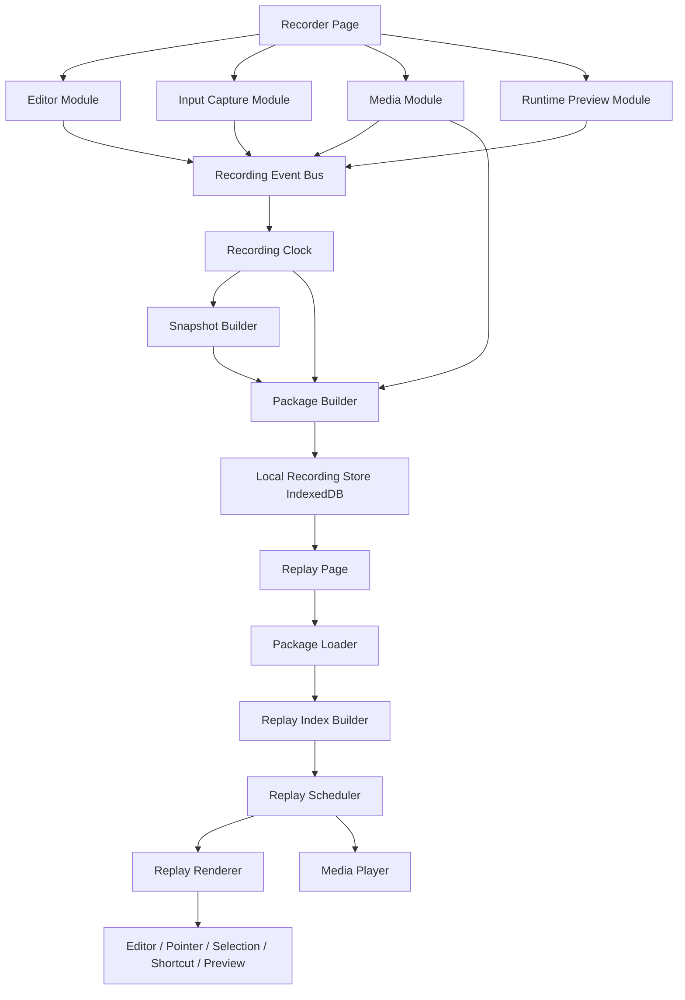
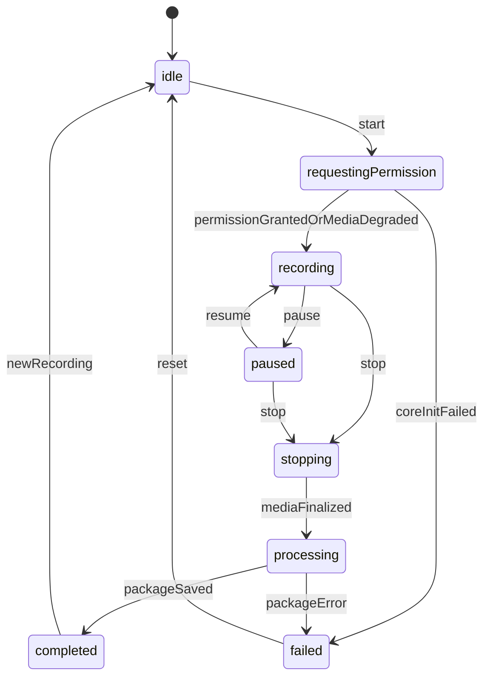
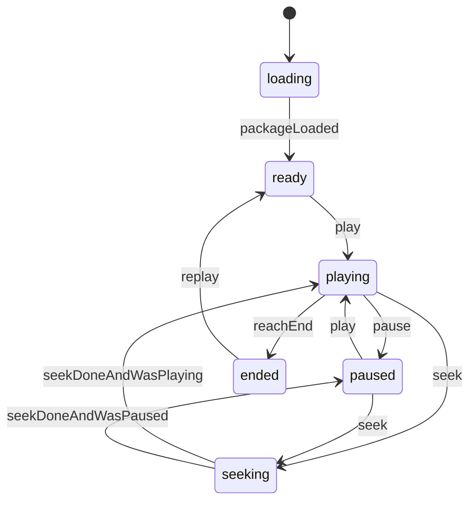
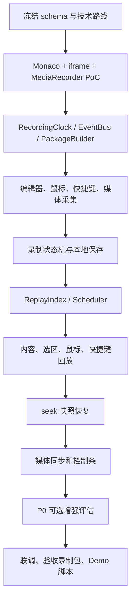

# 代码讲解工具技术方案

> **阅读摘要**
>
> 本方案以 `docs/PRD/代码讲解工具.md` 为最高权威来源，结合 `docs/技术模块拆解.md`、`docs/项目时间规划.md` 与 `docs/竞品分析/` 的结论，给出 code-tape 的 P0/P1/P1+ 技术路线。P0 采用 **事件流优先、音视频辅助、前端 iframe 沙箱展示、本地录制包优先** 的低风险方案：用 Web 编辑器采集代码内容、光标选区、鼠标轨迹、快捷键和运行结果，用 MediaRecorder 采集麦克风与摄像头，用统一时间轴生成录制包，再由回放调度器基于快照和事件增量恢复任意时间点状态。P1 再补齐云端回放中心、分享、活动索引和更完整的代码执行；P1+ 扩展 WebRTC 实时面试与 AI 字幕。

## 一、方案依据与核心判断

### 1. 权威来源

本方案按以下优先级使用文档信息：

1. `docs/PRD/代码讲解工具.md`：最高权威，决定产品目标、P0/P1/P1+ 范围和验收口径。
2. `docs/技术模块拆解.md`：作为模块边界、技术挑战和实施顺序依据。
3. `docs/项目时间规划.md`：作为两周冲刺与 DDL 收敛依据。
4. `docs/竞品分析/`：作为技术路线取舍、产品体验借鉴和 P1/P1+ 边界参考。

PRD 明确要求本项目不是传统录屏，而是记录带时间戳的操作事件流，并在回放时还原编辑器内容、鼠标、光标选区、快捷键、音视频和控制体验。因此本方案所有架构设计都围绕“结构化时间线”展开。

### 2. 竞品结论与本项目取舍

竞品分析的共同点是“代码讲解比普通录屏更需要结构化时间线”，但各竞品对终端、文件树、运行环境和观看者接管的投入并不一致。本项目按 PRD 和 DDL 约束优先交付录制/回放主链路，把容易放大工程复杂度的 IDE 能力后置。

| 竞品/方向 | 最有价值启发 | 与本项目的分歧 | P0 取舍 |
| --- | --- | --- | --- |
| Scrimba | 播放器即 IDE，事件回放可被观看者临时接管 | 观看者编辑和 fork 会引入双轨状态 | P0 先只读回放，观看者临时编辑放 P1 可选 |
| Replay.io | 时间轴 + 事件索引 + 快照恢复比线性视频更适合 seek | Replay 偏调试器级别时间旅行，本项目只需讲解回放 | P0 做快照 + 增量事件，不做调试器能力 |
| CodeSandbox | iframe / Browser Sandbox 适合教学 Demo 的前端预览 | 完整工程预览和依赖管理超出 PRD P0 | P0 采用 iframe sandbox，不上云端容器 |
| StackBlitz / WebContainers | 浏览器内 Node/npm 很强 | WebContainers 部署、兼容和包安装成本高 | P1 做 PoC，P0 不接入 WebContainers |
| CodeSignal / HackerRank | 面试 replay 证明 key-by-key 过程有复盘价值 | 判题、题库和多人面试不是 P0 主链路 | P0 录制完整代码快照事件，P1 再优化 diff/operation log |
| Codecast / RecDev | 事件流主轨 + 音视频辅助 + 代码/终端可复制 | 终端、文件树、checkpoint 会显著扩大实现面 | P0 不做终端和文件树，但事件结构预留扩展 |
| CoderPad | Monaco + 运行结果 + 回放控制是成熟面试平台核心 | CoderPad 的协作和面试管理不是 P0 范围 | P0 选 Monaco，JS 运行结果进入事件流 |

### 3. P0 默认决策

`docs/技术模块拆解.md` 中列出的待确认问题，本方案给出可执行默认决策：

| 问题 | 决策 | 理由 |
| --- | --- | --- |
| 代码执行路线 | P0 采用前端 iframe sandbox 展示，P1 再评估 WebContainers 或后端沙箱 | 最低风险，符合 CodeSandbox/Scrimba/StackBlitz 调研结论 |
| TypeScript 执行深度 | P0 必达支持 TS 编辑、高亮、录制和回放；TS 简单运行列为 P0 可选 PoC，不做 type checking 和 npm 依赖 | 避免把主链路拖进完整构建系统，确保 JS 运行稳定优先 |
| 音视频封装 | P0 录制为一个 WebM 媒体轨；录制前可选择输入设备；麦克风和摄像头开关记录为 media marker | MediaRecorder 实现简单，回放同步成本最低 |
| 录制包保存 | P0 本地 IndexedDB 保存并支持加载回放；文件导出作为保存失败兜底；云端上传放 P1 | 两周内优先保证录制 -> 保存 -> 回放闭环 |
| 其他语言加分项 | Python 只作为 P0 可选加分：高亮、语言切换和回放恢复，不做执行 | 不让加分项阻塞 JS/TS 主链路 |

## 二、目标、非目标与验收口径

### 1. P0 目标

P0 目标是在 DDL 前交付可展示 Demo，证明“代码讲解可被结构化录制并交互回放”成立。

P0 必须完成：

- 录制者可以在内置编辑器中编写 JS/TS 代码，包括语法高亮、基础补全和常用编辑器快捷键（格式化、注释、撤销、跳转、运行）。
- 系统能采集内容变更、光标选区、鼠标轨迹、快捷键。
- 系统能采集麦克风音频和摄像头视频，支持录制前切换录制设备、基础开关和悬浮预览。
- 录制总控支持开始、暂停、继续、结束，并显示录制时长。
- 录制结束后生成可保存、可加载的录制包。
- 回放支持播放、暂停、继续、倍速、进度条 seek、音量和静音。
- 回放能同步展示编辑器内容、鼠标激光笔、光标选区、快捷键浮层、摄像头视频。
- JavaScript 代码运行采用 iframe sandbox 展示结果，stdout / stderr / error 进入录制事件。
- 建立 TailwindCSS + CSS variables 的主题体系，提供深浅主题切换入口，切换后录制页和回放页关键控件不出现颜色语义丢失。

P0 可选增强，不阻塞主链路验收：

- TypeScript 简单运行：仅支持浏览器可 transpile 的单文件代码，不做类型检查、npm 依赖或 Node API。
- 运行预览 DOM 快照：能稳定捕获时进入录制包；不能稳定捕获时只回放 stdout / stderr / error。
- Python 高亮：只做语言切换、高亮、录制语言状态和回放恢复，不做执行。
- 本地回放中心的重命名、删除、缩略图。

### 2. P0 非目标

以下能力不进入 P0 主链路：

- 完整后端代码沙箱、容器隔离、多语言判题。
- WebContainers、npm install、终端、dev server。
- 多人实时协作、WebRTC 双向音视频通话。
- 账号体系、云端权限、团队分享和评论。
- 完整课程平台、挑战题、AI feedback。
- 精细文本 diff/OT/CRDT 级事件模型。
- 重新执行历史运行结果来驱动回放。
- 不将 TypeScript 运行、Python 执行、npm import、Node API 作为 P0 必达能力。
- 运行时 DOM 状态的像素级或框架级精确恢复。
- P0 不提供章节标记 UI 入口；事件 schema 中的 `chapter-marker` 仅作为 P1 章节能力 schema 预留，P0 不写入、不渲染、不进入回放控制条。

### 3. P1 / P1+ 目标

P1 做产品化体验：

- 云端回放中心：上传、列表、播放、删除、重命名。
- 分享链接：支持 `?t=12345` 时间点定位。
- 活动索引：编辑、运行、错误、快捷键、静默段。
- 更完整的 console/error 面板。
- WebContainers PoC 或后端沙箱 PoC。
- 观看者暂停后临时编辑和 fork，作为竞品启发型增强，不作为 P1 主验收。

P1+ 做挑战项：

- WebRTC 实时面试分两级：
  - 最小展示版：同步编辑事件和录制状态，让面试官实时看到候选人的编辑器状态。
  - 完整版：增加 WebRTC 双向音视频、网络抖动下的时序同步、面试后保存为回放。
- AI 字幕分两级：
  - 最小展示版：录制后生成带时间戳字幕，回放时滚动展示并支持点击 seek。
  - 完整版：接入术语/变量名纠错、自动分段和章节生成。
- 课程/题目组织、批注评论、团队复盘列为更远期产品化方向，不作为 PRD P1+ 验收口径。

## 三、总体架构

### 1. 架构图



### 2. 分层说明

| 层 | 职责 | P0 关键点 |
| --- | --- | --- |
| 采集层 | 从编辑器、DOM、媒体、运行沙箱产生事件 | 各采集器只产事件，不直接写录制包 |
| 时间轴层 | 统一相对时间、暂停偏移、事件排序 | 暂停期间不累积有效录制时间 |
| 快照层 | 生成稳定状态快照，支持 seek | 初始快照 + 周期快照 + 语义快照 |
| 打包层 | 合并 meta、events、snapshots、media | schema version 固定，便于后续迁移 |
| 存储层 | 保存录制包和媒体 Blob | P0 用 IndexedDB，本地回放中心加载 |
| 回放层 | 加载包、建索引、调度事件、恢复状态 | 所有跳转统一走 `seek(targetTime)` |
| 展示层 | 渲染编辑器、鼠标、选区、快捷键、预览和媒体 | 回放不默认重新执行用户代码 |

### 3. 技术栈建议

| 模块 | 建议技术 | 说明 |
| --- | --- | --- |
| 应用框架 | Vite + React + TypeScript | 前端组易上手，构建快，适合 Demo |
| 编辑器 | Monaco Editor | JS/TS 支持成熟，VS Code 体验接近 CoderPad/CodeSandbox |
| 图标 | lucide-react | 满足工具按钮、播放控制、开关、状态提示 |
| 状态管理 | React hooks + Context + reducer；跨模块共享状态达到触发条件后引入 Zustand | P0 先按状态作用域拆清责任，再决定是否需要小型全局 store |
| 样式实现 | TailwindCSS + CSS variables + 少量全局 CSS | Tailwind 纳入 P0 工程栈；主题、状态色和组件语义由 token 承载 |
| 主题系统 | CSS variables + `ThemeProvider` + localStorage 持久化 | 深浅主题切换进入 P0 必达，默认跟随系统并允许用户显式切换 |
| 交互组件 | Radix primitives + 自定义样式 | Dialog、Popover、Tooltip、Toggle 等保证可访问性和稳定行为 |
| 媒体采集 | MediaDevices + MediaRecorder | 浏览器原生能力，适合本地录制 |
| 本地存储 | IndexedDB，封装轻量 repository | 支持 Blob 与结构化数据 |
| iframe 沙箱 | sandboxed iframe + postMessage | P0 前端运行/展示路线 |
| TS 简单运行 | 浏览器侧 transpile，先不做 type checking | 支持简单 TS Demo，不承诺完整工程 |
| 测试 | Vitest + Testing Library + Playwright | 核心算法单测，关键录制/回放 e2e |

### 4. 状态管理责任边界

P0 不以“是否全局 store”为第一问题，而以状态的作用域、更新频率、可测试性和持久化边界拆分。

| 状态类别 | P0 归属 | 更新频率 | 持久化 | 示例 |
| --- | --- | --- | --- | --- |
| 组件瞬态 UI | hooks | 高频或交互即时 | 不持久化 | hover、popover open、tab、输入框临时值、按钮 disabled |
| 低频跨树上下文 | Context | 低频 | 按需持久化 | theme、当前录制包 id、全局配置、repository/runtime 依赖注入 |
| 局部流程状态 | reducer | 中频，必须可追踪 | 关键结果落事件或存储 | 录制控制条、回放控制条、保存流程、权限申请流程 |
| 录制事实源 | 框架无关 controller + event bus | 高频 | 写入录制包 | `RecordingClock`、`EventBus`、`RecordingController` 产出的事件 |
| 回放事实源 | `ReplayScheduler` + `ReplayReducer` | 高频 | 由录制包恢复 | 当前 timeline、`lastAppliedSeq`、`ReplayStableState` |
| 跨模块共享工作台状态 | Zustand 触发后承接 | 中高频 | 只持久化必要偏好 | 录制/回放页多个面板共同订阅的状态、布局偏好、显示开关 |

边界规则：

- hooks 只处理组件自身可丢弃状态；不能承接录制事实、回放事实或跨模块业务状态。
- Context 只放低频共享上下文；不能放事件流、鼠标轨迹、播放器 tick、媒体 `currentTime` 这类高频值。
- reducer 用于状态迁移必须显式、可测试的局部流程；每个 action 需要能解释“为什么从 A 到 B”。
- `RecordingClock`、`EventBus`、`RecordingController`、`ReplayScheduler`、`ReplayReducer`、schema validators 保持纯 TypeScript 或低 React 耦合；React 只负责订阅状态和派发命令。
- Zustand 的引入条件是：同一状态被三个以上跨模块面板订阅，或 Context 嵌套 / props drilling 已经影响实现清晰度，或多个组件需要原子更新同一状态切片。
- Redux Toolkit 不作为 P0 默认，除非后续多人协作、复杂服务端缓存或审计工具链成为主目标；XState 可在 P1 状态机复杂度显著上升时重新评估。

### 5. 建议目录结构

```text
apps/web/
  tailwind.config.ts
  postcss.config.js
  src/
    app/
      App.tsx
      routes.tsx
    features/
      editor/
        CodeEditor.tsx
        editorState.ts
        monacoLanguages.ts
      recorder/
        RecorderPage.tsx
        recordingClock.ts
        recordingController.ts
        eventBus.ts
        packageBuilder.ts
      capture/
        editorProducer.ts
        pointerProducer.ts
        shortcutProducer.ts
        mediaProducer.ts
      media/
        mediaDevices.ts
        mediaRecorder.ts
        CameraPreview.tsx
      runtime-preview/
        PreviewPane.tsx
        iframeRuntime.ts
        previewCompiler.ts
      player/
        ReplayPage.tsx
        packageLoader.ts
        replayIndex.ts
        replayScheduler.ts
        replayState.ts
        ReplayControls.tsx
      library/
        RecordingLibraryPage.tsx
        recordingStore.ts
    shared/
      recording-schema/
        types.ts
        validators.ts
      time/
        duration.ts
      ui/
        themeProvider.tsx
        themeTokens.ts
        IconButton.tsx
        Toolbar.tsx
        Slider.tsx
        Toggle.tsx
    styles/
      tokens.css
      globals.css
```

P0 可以先把所有代码放在 `apps/web` 内，避免提前拆 package。若后续录制 schema 被后端、CLI 或播放器 SDK 复用，再把 `shared/recording-schema` 抽成独立包。

## 四、录制包与事件模型

### 1. 设计原则

- **事件流是事实源**：代码、光标、鼠标、快捷键、运行结果以事件和快照恢复。
- **媒体是同步轨道**：音视频增强讲解氛围，但不作为代码事实源。
- **完整快照优先于过早优化**：P0 内容变更记录完整代码，降低 seek 难度。
- **回放不默认重跑代码**：运行结果与 preview snapshot 在录制时保存，回放只展示当时结果。
- **schema 可演进**：所有包和事件包含 `schemaVersion`，P1 可迁移 diff、多文件、终端。

### 2. 录制包结构

```ts
export type RecordingPackageV1 = {
  schemaVersion: "0.1.0";
  manifest: RecordingManifest;
  meta: RecordingMeta;
  events: RecordingEvent[];
  snapshots: RecordingSnapshot[];
  media: RecordingMedia | null;
  indexes?: RecordingIndexes;
};

export type RecordingManifest = {
  packageId: string;
  schemaVersion: "0.1.0";
  status: "draft" | "complete";
  createdAt: string;
  completedAt: string | null;
  checksums: {
    eventsSha256: string;
    snapshotsSha256: string;
    mediaSha256?: string;
  };
};

export type RecordingMeta = {
  id: string;
  title: string;
  createdAt: string;
  durationMs: number;
  appVersion: string;
  ownerId: string | null;
  creatorInfo: { displayName: string; source: "local" | "account" } | null;
  initialLanguage: "javascript" | "typescript" | "python";
  initialFontSize: number;
  initialTheme: "light" | "dark";
  mediaCapability: MediaCapability;
};

export type RecordingMedia = {
  blobId: string;
  mimeType: string;
  durationMs: number;
  sizeBytes: number;
  timelineOffsetMs: number;
  hasAudio: boolean;
  hasCamera: boolean;
};

export type RecordingIndexes = {
  generatedAt: string;
  eventsByType: Record<RecordingEventType, number[]>;
  snapshotSeqsByTime: number[];
  markers: Array<{ timestampMs: number; eventSeq: number; type: RecordingEventType }>;
};
```

在 IndexedDB 中，`events`、`snapshots`、`meta` 和 `manifest` 存结构化 JSON，媒体以 Blob 存在单独 object store。`blobId` 用于关联媒体轨。`manifest.status` 只有从 `draft` 切换到 `complete` 后才允许进入回放列表，避免刷新或 quota 中断留下半成品包。

### 3. 事件 envelope

```ts
export type RecordingEventType =
  | "record-start"
  | "record-pause"
  | "record-resume"
  | "resume-baseline"
  | "record-stop"
  | "content-change"
  | "language-change"
  | "selection-change"
  | "editor-scroll"
  | "mouse-move"
  | "mouse-click"
  | "shortcut"
  | "media-toggle"
  | "media-warning"
  | "camera-position"
  | "run-start"
  | "run-output"
  | "run-error"
  | "chapter-marker";

export type BaseRecordingEvent<
  TType extends RecordingEventType,
  TSource extends RecordingEventSource,
  TTrack extends RecordingEventTrack,
  TPayload
> = {
  id: string;
  seq: number;
  timestampMs: number;
  wallTime?: string;
  source: TSource;
  track: TTrack;
  type: TType;
  payload: TPayload;
};

export type RecordingEvent =
  | BaseRecordingEvent<"record-start", "recorder", "main", RecordStartPayload>
  | BaseRecordingEvent<"record-pause", "recorder", "main", RecordPausePayload>
  | BaseRecordingEvent<"record-resume", "recorder", "main", RecordResumePayload>
  | BaseRecordingEvent<"resume-baseline", "recorder", "main", ResumeBaselinePayload>
  | BaseRecordingEvent<"record-stop", "recorder", "main", RecordStopPayload>
  | BaseRecordingEvent<"content-change", "editor", "main", ContentChangePayload>
  | BaseRecordingEvent<"language-change", "editor", "main", LanguageChangePayload>
  | BaseRecordingEvent<"selection-change", "editor", "main", SelectionChangePayload>
  | BaseRecordingEvent<"editor-scroll", "editor", "main", EditorScrollPayload>
  | BaseRecordingEvent<"mouse-move", "pointer", "ui", PointerPayload>
  | BaseRecordingEvent<"mouse-click", "pointer", "ui", PointerClickPayload>
  | BaseRecordingEvent<"shortcut", "shortcut", "ui", ShortcutPayload>
  | BaseRecordingEvent<"media-toggle", "media", "media", MediaTogglePayload>
  | BaseRecordingEvent<"media-warning", "media", "media", MediaWarningPayload>
  | BaseRecordingEvent<"camera-position", "media", "ui", CameraPositionPayload>
  | BaseRecordingEvent<"run-start", "runtime", "runtime", RunStartPayload>
  | BaseRecordingEvent<"run-output", "runtime", "runtime", RunOutputPayload>
  | BaseRecordingEvent<"run-error", "runtime", "runtime", RunErrorPayload>
  | BaseRecordingEvent<"chapter-marker", "annotation", "ui", ChapterMarkerPayload>;

export type RecordingEventSource =
  | "recorder"
  | "editor"
  | "pointer"
  | "shortcut"
  | "media"
  | "runtime"
  | "annotation";

export type RecordingEventTrack = "main" | "media" | "runtime" | "ui";

```

`timestampMs` 使用录制有效时间，不包含暂停间隔。例如录制 10 秒后暂停 30 秒，再继续 5 秒，结束时 `durationMs` 为 15000。

### 4. P0 payload 最小类型

```ts
export type RecordStartPayload = {
  initialLanguage: "javascript" | "typescript" | "python";
  initialTheme: "light" | "dark";
  initialFontSize: number;
  selectedAudioDeviceId: string | null;
  selectedCameraDeviceId: string | null;
  mediaCapability: MediaCapability;
};

export type RecordPausePayload = { reason: "user"; stateSeq: number };
export type RecordResumePayload = { reason: "user"; baselineSnapshotId?: string };
export type RecordStopPayload = { durationMs: number; reason: "user" | "error" };
export type ResumeBaselinePayload = { snapshot: ReplayStableState; reason: "paused-state-changed" };

export type ContentChangePayload = {
  // Full code after producer-side coalescing. Do not persist one event per keystroke.
  fileId: "main";
  version: number;
  code: string;
  contentHash: string;
  language: "javascript" | "typescript" | "python";
  changeReason: "input" | "paste" | "format" | "undo" | "redo" | "programmatic";
  changeCount: number;
  flushedBy: "debounce" | "idle" | "paste" | "format" | "undo" | "redo" | "run" | "pause" | "stop" | "snapshot";
};

export type LanguageChangePayload = {
  from: "javascript" | "typescript" | "python";
  to: "javascript" | "typescript" | "python";
};

export type SelectionChangePayload = {
  cursor: { lineNumber: number; column: number } | null;
  selection: {
    startLineNumber: number;
    startColumn: number;
    endLineNumber: number;
    endColumn: number;
  } | null;
};

export type EditorScrollPayload = { scrollTop: number; scrollLeft: number };
export type PointerPayload = { x: number; y: number; containerWidth: number; containerHeight: number };
export type PointerClickPayload = PointerPayload & { button: 0 | 1 | 2 };
export type ShortcutPayload = { keys: string[]; label: string; command?: string };
export type MediaTogglePayload = { microphoneEnabled: boolean; cameraEnabled: boolean };
export type MediaWarningPayload = {
  target: "audio" | "camera" | "recorder";
  code: "permission-denied" | "not-found" | "busy" | "track-ended" | "recorder-error";
  message: string;
};
export type CameraPositionPayload = { x: number; y: number };
export type RunStartPayload = { language: "javascript" | "typescript"; runtime: "iframe"; runId: string };
export type RunOutputPayload = {
  runId: string;
  stdout: string[];
  stderr: string[];
  previewHtml: string | null;
  status: "success";
};
export type RunErrorPayload = {
  runId: string;
  phase: "transpile" | "runtime";
  message: string;
  stack?: string;
  stdout: string[];
  stderr: string[];
  previewHtml: string | null;
};
export type ChapterMarkerPayload = { title: string; note?: string };
```

### 5. P0 事件类型

| 类型 | source | 是否影响稳定状态 | payload |
| --- | --- | --- | --- |
| `record-start` | recorder | 是 | 初始语言、主题、字号、设备与媒体能力 |
| `record-pause` | recorder | 是 | 暂停点 |
| `record-resume` | recorder | 是 | 继续点 |
| `resume-baseline` | recorder | 是 | 暂停期间状态变化后的完整稳定状态 |
| `record-stop` | recorder | 是 | 结束点、duration |
| `content-change` | editor | 是 | fileId、version、合并后的完整代码、contentHash、语言、changeReason、flushedBy |
| `language-change` | editor | 是 | from、to |
| `selection-change` | editor | 是 | cursor、selection |
| `editor-scroll` | editor | 是 | scrollTop、scrollLeft |
| `mouse-move` | pointer | 是 | x、y、containerWidth、containerHeight |
| `mouse-click` | pointer | 短生命周期 + 位置 | x、y、button |
| `shortcut` | shortcut | 短生命周期 | keys、label |
| `media-toggle` | media | 是 | microphoneEnabled、cameraEnabled |
| `media-warning` | media | 否 | target、code、message |
| `camera-position` | media | 是 | x、y |
| `run-start` | runtime | 是 | language、runtime |
| `run-output` | runtime | 是 | stdout、stderr、previewHtml、status |
| `run-error` | runtime | 是 | phase、message、stack、stdout、stderr、previewHtml |
| `chapter-marker` | annotation | 否 | title、note |

P0 不采集普通字符 keypress 作为事实源，因为内容变化已经由 `content-change` 覆盖。快捷键只记录控制类操作，例如格式化、注释、撤销、运行。`content-change` 虽保存完整代码，但必须在 `editorProducer` 侧合并短间隔输入，不能把 Monaco 每次 `onDidChangeModelContent` 都直接写成持久化事件。

事件排序和校验规则：

- `seq` 是唯一事实顺序，必须从 1 开始单调递增，不允许重复。
- 回放和建索引统一按 `(timestampMs, seq)` 升序处理；同一个 `timestampMs` 内以 `seq` 决定先后。
- 坐标单位是编辑器容器内 CSS pixel；回放按 `containerWidth/containerHeight` 做比例映射。
- loader 遇到未知 `type` 时跳过该事件并记录 warning；遇到已知 `type` 但 payload 校验失败时阻止加载并展示损坏包错误。

### 6. 快照结构

```ts
export type RecordingSnapshot = {
  id: string;
  timestampMs: number;
  // Inclusive: this snapshot already includes all events whose seq <= eventSeq.
  eventSeq: number;
  state: ReplayStableState;
};

export type ReplayStableState = {
  editor: {
    code: string;
    language: "javascript" | "typescript" | "python";
    cursor: { lineNumber: number; column: number } | null;
    selection: {
      startLineNumber: number;
      startColumn: number;
      endLineNumber: number;
      endColumn: number;
    } | null;
    scrollTop: number;
    scrollLeft: number;
    fontSize: number;
    theme: "light" | "dark";
  };
  pointer: {
    x: number;
    y: number;
    visible: boolean;
  } | null;
  media: {
    microphoneEnabled: boolean;
    cameraEnabled: boolean;
    cameraPosition: { x: number; y: number };
  };
  runtime: {
    status: "idle" | "running" | "success" | "error";
    stdout: string[];
    stderr: string[];
    previewHtml: string | null;
    errorMessage: string | null;
  };
};
```

### 7. 快照生成策略

P0 使用混合策略：

- 录制开始生成初始快照。
- 每 5 秒生成周期快照。
- 每 50 个稳定状态事件生成一个快照。
- 发生暂停、继续、语言切换、运行完成、大段粘贴时生成语义快照。

这样能把 seek 恢复成本控制在“最近 5 秒或 50 个事件内”，避免长录制从头重放。

### 8. schema 校验与迁移

录制包加载必须先校验，再建索引：

```ts
export type PackageLoadResult =
  | { ok: true; package: RecordingPackageV1; mediaBlob: Blob | null; warnings: PackageWarning[] }
  | { ok: false; error: PackageLoadError };

export type PackageLoadError =
  | { code: "unsupported-schema"; schemaVersion: string }
  | { code: "invalid-manifest"; message: string }
  | { code: "invalid-event"; seq?: number; message: string }
  | { code: "checksum-mismatch"; target: "events" | "snapshots" | "media" }
  | { code: "incomplete-package"; packageId: string };

export type PackageWarning =
  | { code: "media-missing"; blobId: string }
  | { code: "unknown-event-skipped"; seq: number; type: string };
```

P0 提供 `validateRecordingPackageV1()` 和 `migrateRecordingPackage(input)` 两个入口。`migrateRecordingPackage` 内部维护 migration registry，例如 `0.1.0 -> 0.2.0`，每次 schema 升级必须同时补迁移脚本和旧包 fixture。缺失媒体 Blob 时，回放页仍可进入纯事件流回放，并展示“该录制缺少音视频轨”的降级提示。

校验与加载的对外签名：

```ts
export type SchemaValidationResult =
  | { ok: true }
  | { ok: false; errors: Array<{ path: string; message: string }> };

export function validateRecordingPackageV1(input: unknown): SchemaValidationResult;

export type MigrationRegistryEntry = {
  from: string;
  to: string;
  migrate(input: unknown): unknown;
};

export type MigrateResult =
  | { ok: true; package: RecordingPackageV1; appliedMigrations: string[] }
  | { ok: false; error: PackageLoadError };

export function migrateRecordingPackage(input: unknown): MigrateResult;

export type PackageLoaderInput =
  | { kind: "indexeddb"; recordingId: string }
  | { kind: "file"; zip: Blob };

export type PackageLoader = {
  load(input: PackageLoaderInput): Promise<PackageLoadResult>;
};
```

`PackageLoader.load` 内部固定执行顺序：解包 → `validateRecordingPackageV1` → `migrateRecordingPackage` → checksum 校验 → 关联媒体 Blob。任一阶段失败按 `PackageLoadError` 编码返回，不抛裸异常。

## 五、录制链路设计

### 1. 录制状态机



状态说明：

| 状态 | 行为 |
| --- | --- |
| `idle` | 可编辑、可配置语言；已有权限时可枚举并选择麦克风/摄像头 |
| `requestingPermission` | 请求麦克风/摄像头权限，并初始化编辑器、事件总线和媒体能力 |
| `recording` | 事件采集、媒体录制和计时器运行 |
| `paused` | 暂停事件写入与媒体录制；P0 锁定编辑器、运行、语言切换、摄像头拖拽等会改变回放状态的输入 |
| `stopping` | 停止采集器和媒体轨道 |
| `processing` | 生成快照、录制包和本地存储记录 |
| `completed` | 展示保存结果和进入回放入口 |
| `failed` | 仅用于编辑器、事件采集、包生成等核心能力失败；展示明确错误并释放设备资源 |

媒体权限失败不进入 `failed`，而是进入降级录制。P0 使用独立的 `mediaCapability` 记录音视频可用性：

```ts
export type MediaCapability = {
  audio: "available" | "denied" | "not-found" | "busy" | "unsupported";
  camera: "available" | "denied" | "not-found" | "busy" | "unsupported";
  selectedAudioDeviceId: string | null;
  selectedCameraDeviceId: string | null;
};
```

如果产品后续要求暂停期间继续编辑，`resume` 时必须写入完整 `resume-baseline` 快照，明确这段暂停编辑在回放中表现为一次状态跳变。P0 为降低回放复杂度，默认选择锁定影响回放状态的输入。

`RecordingController` 是录制状态机的对外指令面，封装编辑器、采集器、媒体录制和包构建之间的协作：

```ts
export type RecordingControllerStatus =
  | "idle"
  | "requestingPermission"
  | "recording"
  | "paused"
  | "stopping"
  | "processing"
  | "completed"
  | "failed";

export type RecordingControllerState = {
  status: RecordingControllerStatus;
  startedAt: string | null;
  durationMs: number;
  mediaCapability: MediaCapability;
  lastError: { code: string; message: string } | null;
};

export type RecordingControllerDeps = {
  clock: RecordingClock;
  bus: EventBus;
  producers: EventProducer[];
  media: MediaRecorderWrapper | null;
  packageBuilder: PackageBuilder;
  repository: RecordingRepository;
};

export type RecordingController = {
  state: RecordingControllerState;
  start(input: RecordStartPayload): Promise<void>;
  pause(): void;
  resume(): Promise<void>;
  stop(reason: "user" | "error"): Promise<RecordingPackageV1>;
  reset(): void;
  subscribe(listener: (state: RecordingControllerState) => void): () => void;
};
```

`PackageBuilder` 在 `stop` 阶段把事件、快照、媒体与索引合并成一个 `RecordingPackageV1`，是录制链路与存储/回放层之间的唯一序列化入口：

```ts
export type PackageBuildInput = {
  meta: RecordingMeta;
  events: RecordingEvent[];
  snapshots: RecordingSnapshot[];
  media: { blob: Blob; durationMs: number; mimeType: string; hasAudio: boolean; hasCamera: boolean } | null;
};

export type PackageBuilder = {
  build(input: PackageBuildInput): Promise<{ pkg: RecordingPackageV1; mediaBlob: Blob | null }>;
};
```

### 2. RecordingClock

`RecordingClock` 是 P0 同步质量的关键模块。

职责：

- 提供 `now()`，返回有效录制时间。
- 管理暂停区间，不把暂停时长计入 `timestampMs`。
- 向事件生产者提供统一时间戳。
- 在结束时输出 `durationMs`。

核心规则：

```ts
effectiveTime = performance.now() - startTime - totalPausedDuration
```

暂停时记录 `pauseStartedAt`；继续时把 `performance.now() - pauseStartedAt` 累加到 `totalPausedDuration`。

对外接口：

```ts
export type RecordingClockStatus = "idle" | "running" | "paused" | "stopped";

export type RecordingClock = {
  status: RecordingClockStatus;
  start(): void;
  pause(): void;
  resume(): void;
  stop(): void;
  // Effective ms since record-start; excludes paused intervals. Monotonic between pauses.
  now(): number;
  // Final duration after stop; before stop returns current effective duration.
  durationMs(): number;
  subscribe(listener: (status: RecordingClockStatus) => void): () => void;
};
```

### 3. EventProducer 抽象

`EventBus` 是采集层与 `RecordingController` / `PackageBuilder` 之间的唯一事件出口。Producer 不直接写录制包，只调用 `bus.emit`；bus 负责分配单调 `seq`、附 `timestampMs` 并按订阅广播：

```ts
export type EventBusInput<TType extends RecordingEventType> = {
  type: TType;
  source: RecordingEventSource;
  track: RecordingEventTrack;
  payload: Extract<RecordingEvent, { type: TType }>["payload"];
  wallTime?: string;
};

export type EventBus = {
  // Returns the fully populated event (with seq and timestampMs assigned).
  emit<TType extends RecordingEventType>(input: EventBusInput<TType>): Extract<RecordingEvent, { type: TType }>;
  drain(): RecordingEvent[];                                // Returns all emitted events and clears the buffer
  peek(): readonly RecordingEvent[];                        // Read-only snapshot, used by snapshot builder
  subscribe(listener: (event: RecordingEvent) => void): () => void;
  reset(): void;
};
```

`seq` 在 bus 内部维护、暂停后不重置；`timestampMs` 由注入的 `RecordingClock.now()` 提供，保证暂停期间不累积。

每类采集器实现同一接口：

```ts
export type EventProducer = {
  start(): void;
  pause(): void;
  resume(): void;
  stop(): void;
  dispose(): void;
};
```

各 Producer 只负责监听和发事件：

| Producer | 输入 | 输出事件 |
| --- | --- | --- |
| `editorProducer` | Monaco model/content/selection/scroll | `content-change`、`selection-change`、`editor-scroll`、`language-change` |
| `pointerProducer` | 编辑器区域 pointer events | `mouse-move`、`mouse-click` |
| `shortcutProducer` | keydown + Monaco commands | `shortcut` |
| `mediaProducer` | 麦克风/摄像头开关、预览拖拽 | `media-toggle`、`camera-position` |
| `runtimeProducer` | Run 按钮、iframe 消息 | `run-start`、`run-output`、`run-error` |

各 Producer 的构造依赖统一通过工厂函数注入，保持框架无关：

```ts
import type * as Monaco from "monaco-editor";

export type ProducerCommonDeps = {
  bus: EventBus;
};

export type CreateEditorProducer = (deps: ProducerCommonDeps & {
  editor: Monaco.editor.IStandaloneCodeEditor;
  model: Monaco.editor.ITextModel;
  // Producer-side debounce / idle / semantic flush thresholds.
  contentChange?: { debounceMs?: number; idleFlushMs?: number };
}) => EventProducer;

export type CreatePointerProducer = (deps: ProducerCommonDeps & {
  container: HTMLElement;
  throttleMs?: number;          // P0 default 30
}) => EventProducer;

export type CreateShortcutProducer = (deps: ProducerCommonDeps & {
  editor: Monaco.editor.IStandaloneCodeEditor;
  container: HTMLElement;
}) => EventProducer;

export type CreateMediaProducer = (deps: ProducerCommonDeps & {
  devices: MediaDevicesController;
  cameraPreview: { getPosition(): { x: number; y: number } };
}) => EventProducer;

export type CreateRuntimeProducer = (deps: ProducerCommonDeps & {
  runtime: IframeRuntime;
  compiler: PreviewCompiler;
}) => EventProducer;
```

### 4. Monaco 加载与 worker 约束

Monaco 是 P0 编辑器主路径，但不能把编辑器接入变成首屏和运行稳定性的风险源：

- 编辑器组件使用 lazy load，录制页进入后再加载 Monaco；非编辑器页面不加载 Monaco bundle。
- P0 只启用 JavaScript、TypeScript、Python 相关语言和必要 worker，不加载无关语言包。
- worker 配置必须在 Chrome / Edge latest 下无启动错误、无跨域 worker 报错、无反复重建 worker 的 console error。
- 编辑器首次可输入时间进入 P0 手工验收预算；JS/TS 语法高亮、基础补全和常用快捷键是 P0 必达，不可降级；若 Monaco 加载明显拖慢首屏，先削减无关语言 worker、装饰能力（minimap、folding 等）和非必要扩展，保住编辑体验与补全。

### 5. content-change 采集频率控制

`content-change` 是稳定状态事实源，但 P0 不逐 keystroke 落事件。实现策略：

- Monaco `onDidChangeModelContent` 只更新内存中的 pending editor state，并累计 `changeCount`。
- 普通连续输入使用 300ms debounce；用户持续输入时最多每 1000ms 通过 idle flush 写一条 `content-change`。
- 粘贴、格式化、撤销、重做、语言切换、点击运行、暂停、停止、生成快照前必须立即 flush，避免关键语义点丢失。
- 每次 flush 生成递增 `version` 和 `contentHash`；如果 `contentHash` 与上一条稳定代码一致，不写入新事件，只更新选区或滚动事件。
- P0 只有单文件，`fileId` 固定为 `"main"`；P1 多文件时可扩展为实际文件 id。
- 大段粘贴或格式化只生成一条 `content-change`，`changeReason` 标为 `paste` / `format`，`changeCount` 记录合并次数。
- 当事件总量超过 15,000 条时提示体积风险；超过 20,000 条时降低鼠标采样频率，但 `content-change` 的语义 flush 不丢弃。

这样保留“任意时间可恢复完整代码”的 P0 目标，同时避免 `20,000 × 完整代码` 的纯 JSON 膨胀。

### 6. 鼠标轨迹采样

鼠标移动事件高频且对体积敏感。P0 采用：

- 仅在编辑器区域内记录。
- 30ms 节流一次。
- 坐标保存为相对容器坐标和容器尺寸。
- 回放时按当前容器尺寸等比映射。
- 当整体事件数超过 15,000 条时降级到 80ms；超过 20,000 条时只记录明显移动和点击点。

这样既能保留“讲解者指向哪里”的语义，又不会让事件体积失控。

### 7. 快捷键归一化

快捷键事件用于回放 Badge，不作为内容事实源。

P0 捕获：

- `Ctrl/Cmd + S`：保存。
- `Ctrl/Cmd + /`：注释。
- `Ctrl/Cmd + Z`：撤销。
- `Ctrl/Cmd + Shift + Z`：重做。
- `Alt/Option + Shift + F` 或编辑器格式化命令：格式化。
- `Ctrl/Cmd + G`：跳转到行；Monaco 原生处理，P0 捕获为快捷键 Badge。
- `Ctrl/Cmd + Enter`：运行代码。

事件 payload 保存 `keys` 和面向 UI 的 `label`，例如 `["Mod", "Enter"]` 与 `⌘ Enter` / `Ctrl Enter`。

### 8. 媒体采集

P0 媒体路线：

- 录制开始前通过 `enumerateDevices()` 展示可用麦克风和摄像头；首次无权限时先用最小 `getUserMedia` 请求权限，再刷新设备 label。
- 用户可在 `idle` 状态选择麦克风和摄像头；选中的 `deviceId` 写入 `record-start` payload 和录制包 meta。
- 使用带 `deviceId` 约束的 `getUserMedia` 获取音频与视频。
- 将可用 track 合并成一个 `MediaStream`。
- 用 `MediaRecorder` 生成 WebM Blob。
- 摄像头预览复用本地 stream，不依赖录制结果。
- 麦克风/摄像头开关通过 `MediaStreamTrack.enabled` 控制，并记录 `media-toggle` 事件。
- P0 录制中不切换物理设备；录制中只允许开关当前 track。若需要录制中切换设备，放到 P1 分段媒体模型，新增 `media-segment-start/end` 和 `device-change` 事件。
- 结束录制时停止 recorder，再释放所有 tracks。

异常处理：

| 异常 | P0 行为 |
| --- | --- |
| 用户拒绝麦克风 | 允许无音频录制，页面提示“未录制麦克风” |
| 用户拒绝摄像头 | 允许无摄像头录制，页面提示“未录制摄像头” |
| 两者都拒绝 | 允许仅事件流录制 |
| 录制中设备断开 | 写入 `media-toggle` 和 media warning，finalize partial blob，继续事件流录制 |
| 用户录制中要求切换实体设备 | P0 提示“结束本次录制后可切换设备”；不替换 MediaRecorder track |
| MediaRecorder 不支持 mimeType | 退回浏览器默认 mimeType |

`MediaDevicesController` 把 `enumerateDevices` / `getUserMedia` 等浏览器 API 封到一个面向 UI 的小门面，权限/能力降级在内部完成，不向上层泄漏裸 `DOMException`：

```ts
export type DeviceInfo = { deviceId: string; label: string; kind: "audioinput" | "videoinput" };

export type OpenStreamRequest = {
  audioDeviceId: string | null;
  cameraDeviceId: string | null;
};

export type OpenStreamResult = {
  stream: MediaStream | null;     // null only when both requests were absent
  capability: MediaCapability;
  warnings: MediaWarningPayload[];
};

export type MediaDevicesController = {
  enumerate(): Promise<{ audio: DeviceInfo[]; camera: DeviceInfo[] }>;
  // Requests permission lazily; safe to call before enumerate to refresh labels.
  requestPermission(kind: "audio" | "camera"): Promise<"granted" | "denied" | "not-found" | "busy">;
  openStream(request: OpenStreamRequest): Promise<OpenStreamResult>;
  setTrackEnabled(track: "audio" | "camera", enabled: boolean): void;
  // Stops all tracks and releases device handles; idempotent.
  release(): void;
  subscribe(listener: (capability: MediaCapability) => void): () => void;
};
```

`MediaRecorderWrapper` 与 `RecordingClock` 配套使用，确保 `MediaRecorder.pause/resume` 与有效录制时间同向增长（PoC 必验，见 §七.4）：

```ts
export type MediaRecorderChunk = { data: Blob; timestampMs: number };

export type MediaRecorderResult = {
  blob: Blob;
  mimeType: string;
  durationMs: number;
  hasAudio: boolean;
  hasCamera: boolean;
};

export type MediaRecorderWrapper = {
  start(stream: MediaStream): Promise<void>;
  pause(): void;
  resume(): void;
  // Finalizes recording and returns the merged Blob. Subsequent calls reject.
  stop(): Promise<MediaRecorderResult>;
  onChunk(listener: (chunk: MediaRecorderChunk) => void): () => void;
  onError(listener: (error: MediaWarningPayload) => void): () => void;
};
```

`CameraPreview` 是录制页与回放页共用的摄像头悬浮组件。录制页给可拖拽实例并把位置回调写入 `camera-position` 事件；回放页根据 `ReplayStableState.media.cameraPosition` 渲染为只读：

```ts
export type CameraPreviewProps = {
  stream: MediaStream | null;             // null = render empty placeholder
  enabled: boolean;                       // hides preview while keeping mount stable
  position: { x: number; y: number };     // container-relative px
  draggable: boolean;                     // false in replay mode
  onPositionChange?(next: { x: number; y: number }): void;
};
```

## 六、代码运行与 iframe 沙箱

### 1. 运行范围

P0 运行能力按“JS 稳定优先、TS 可选”收敛：

| 语言 | P0 行为 |
| --- | --- |
| JavaScript | P0 必达，直接注入 sandbox iframe 执行 |
| TypeScript | P0 可选 PoC，使用 `typescript.transpileModule` 做单文件 transpile 后注入 iframe；若体积或兼容性影响主链路，则只保留编辑/高亮/录制/回放 |
| Python | 只做高亮、录制和回放，不执行 |

TypeScript PoC 的实现边界：

- compiler 使用懒加载，不能影响 JavaScript 默认 Demo 的首屏体积和运行稳定性。
- 固定最小 `compilerOptions`：`target: ts.ScriptTarget.ES2020`、`module: ts.ModuleKind.None`、`isolatedModules: true`；只做语法转译，不做 type checking。
- P0 不支持 TSX/JSX、`import/export`、第三方依赖、npm install、Node API、文件系统、网络代理、后端执行。
- 类型错误不描述为运行失败；只有转译异常、compiler 加载失败或 iframe 执行异常写入 `run-error`。
- `run-error.phase` 必须区分 `"transpile"` 和 `"runtime"`；即使转译失败，也要在运行前 flush 当前 `content-change`，保证回放能复现当时的代码和错误。

### 2. iframe 安全边界

iframe 设置：

```html
<iframe sandbox="allow-scripts" />
```

不添加 `allow-same-origin`，避免用户代码读取宿主同源能力；不添加 `allow-popups`，默认禁止弹窗。iframe 使用 `srcdoc`，每次运行创建全新的 iframe 和随机 `runId`。由于 sandbox iframe 是 opaque origin，子页面向父页面发送消息时只能使用 `postMessage(..., "*")`，但父页面必须做 source、runId 和 schema 校验，不能把 `*` 当作信任边界。

Runtime 消息协议：

```ts
export type RuntimeMessage =
  | { source: "code-tape-runtime"; runId: string; type: "ready"; payload: {} }
  | { source: "code-tape-runtime"; runId: string; type: "console"; payload: { level: "log" | "warn" | "error"; args: string[] } }
  | { source: "code-tape-runtime"; runId: string; type: "error"; payload: { message: string; stack?: string } }
  | { source: "code-tape-runtime"; runId: string; type: "blocked-alert"; payload: { message: string } }
  | { source: "code-tape-runtime"; runId: string; type: "complete"; payload: { previewHtml: string } };
```

父页面接收规则：

```ts
function acceptRuntimeMessage(event: MessageEvent, iframe: HTMLIFrameElement, runId: string): RuntimeMessage | null {
  if (event.source !== iframe.contentWindow) return null;
  const data = event.data;
  if (!data || data.source !== "code-tape-runtime" || data.runId !== runId) return null;
  return validateRuntimeMessage(data) ? data : null;
}
```

注入 HTML 结构：

```html
<!doctype html>
<html>
  <head>
    <meta charset="utf-8" />
    <meta http-equiv="Content-Security-Policy" content="default-src 'none'; script-src 'unsafe-inline'; style-src 'unsafe-inline'; img-src data: blob:; connect-src 'none';" />
    <style>body { font-family: sans-serif; }</style>
  </head>
  <body>
    <div id="root"></div>
    <script>
      const runId = "__RUN_ID__";
      const limit = (value) => String(value).slice(0, 2000);
      const send = (type, payload) => parent.postMessage({ source: "code-tape-runtime", runId, type, payload }, "*");
      ["log", "warn", "error"].forEach((level) => {
        const original = console[level];
        console[level] = (...args) => {
          send("console", { level, args: args.map(limit).slice(0, 50) });
          original.apply(console, args);
        };
      });
      window.addEventListener("error", (event) => {
        send("error", { message: limit(event.message), stack: event.error && limit(event.error.stack) });
      });
      window.alert = (message) => send("blocked-alert", { message: limit(message) });
      send("ready", {});
    </script>
    <script type="module">
      try {
        // compiled user code is inserted here
        setTimeout(() => {
          send("complete", { previewHtml: document.documentElement.outerHTML.slice(0, 200000) });
        }, 0);
      } catch (error) {
        send("error", { message: String(error && error.message || error), stack: error && error.stack });
      }
    </script>
  </body>
</html>
```

失控处理：

- 父页面为每次运行设置 3s timeout；这只能覆盖异步超时或未阻塞宿主事件循环的长任务。到时未收到 `complete` 或 `error` 就销毁 iframe，写入 `run-error`，错误码为 `runtime-timeout`。
- P0 示例代码限定为教学 Demo 级别的短任务，不承诺自动终止所有同步死循环。同步死循环可能冻结同一渲染进程，导致父页面 timeout 也无法触发；P0 的真实兜底是页面级“重置预览 / 刷新恢复”指引。
- 点击运行前必须先 flush 当前 `content-change` 和一条语义快照；若用户刷新恢复，至少能从最近保存的编辑器状态继续录制或重新录制当前段落。
- UI 上提供“重置预览”按钮，清空当前 runtime iframe、stdout / stderr 和 pending run 状态；如果按钮也不可响应，错误文案明确提示刷新页面并从本地草稿恢复。
- P1 若要更强隔离，把纯 JS 计算移到 Worker，DOM preview 只接收 Worker 输出后的渲染状态。
- P1+ 若需要运行不可信长任务，再评估独立 origin iframe 或后端/容器沙箱，避免把 P0 Demo 扩成安全沙箱项目。
- 任何 `previewHtml` 回放都只能写入新的 sandbox iframe，不能 `innerHTML` 到宿主 DOM。

`previewCompiler` 把源码转成可注入 iframe 的脚本字符串。P0 只识别 JS/TS，TS 走懒加载 transpile：

```ts
export type CompileLanguage = "javascript" | "typescript";

export type CompileResult =
  | { ok: true; code: string; warnings: string[] }
  | { ok: false; phase: "transpile"; message: string; stack?: string };

export type PreviewCompiler = {
  compile(source: string, language: CompileLanguage): Promise<CompileResult>;
};
```

`iframeRuntime` 是 host 侧对 sandbox iframe 的控制器。每次运行创建新 iframe + 新 `runId`，旧实例必须 destroy；所有消息走 `acceptRuntimeMessage` 校验：

```ts
export type IframeRunInput = {
  runId: string;
  compiledCode: string;
  timeoutMs: number;            // P0 default 3000
};

export type IframeRunResult =
  | { runId: string; status: "complete"; previewHtml: string | null; stdout: string[]; stderr: string[] }
  | { runId: string; status: "error"; phase: "runtime"; message: string; stack?: string; stdout: string[]; stderr: string[] }
  | { runId: string; status: "timeout"; stdout: string[]; stderr: string[] };

export type IframeRuntime = {
  // Mounts a fresh sandboxed iframe into the host container; returns when iframe is ready.
  mount(host: HTMLElement): Promise<void>;
  run(input: IframeRunInput): Promise<IframeRunResult>;
  // Replay an existing previewHtml into a read-only sandbox iframe. Never writes to host DOM.
  renderPreview(previewHtml: string): Promise<void>;
  // Tears down the current iframe and clears pending run state; safe to call repeatedly.
  reset(): void;
  destroy(): void;
};
```

### 3. 运行结果进入录制包

运行时产生：

- `run-start`：点击运行或快捷键运行。
- `run-output`：收到 `complete`，保存 console 输出和 `previewHtml`；如果 `previewHtml` 超过 200KB 或未收到，只保存 stdout / stderr。
- `run-error`：收到 `error`、timeout 或运行 iframe 被销毁，保存错误信息和已捕获输出。

回放时不自动重新执行用户代码，而是把 `run-output` / `run-error` 中的 `previewHtml` 和输出面板恢复出来。恢复 `previewHtml` 时使用只读 sandbox iframe；观看者主动点击“重新运行”时，才使用当前代码进入新的 sandbox。

## 七、回放链路设计

### 1. 回放状态机



### 2. ReplayIndex

录制包加载后构建内存索引：

```ts
export type ReplayIndex = {
  eventsBySeq: RecordingEvent[];
  eventsByType: Map<RecordingEventType, RecordingEvent[]>;
  snapshotsByTime: RecordingSnapshot[];
  stableEventsByTime: RecordingEvent[];
  markersByTime: RecordingEvent[];
};
```

索引用途：

- 快速找到目标时间最近快照。
- 快速找到下一批待应用事件。
- 在时间轴上展示运行点、快捷键、章节、错误。
- 支持 P1 活动密度和分享链接。

### 3. ReplayScheduler API

`ReplayScheduler` 是播放器控制条、媒体元素和编辑器回放之间的唯一调度入口：

```ts
export type ReplayScheduler = {
  load(packageData: RecordingPackageV1): Promise<void>;
  play(): void;
  pause(): void;
  seek(targetTimeMs: number): Promise<void>;
  setRate(rate: 0.5 | 1 | 1.5 | 2): void;
  setVolume(volume: number): void;
  setMuted(muted: boolean): void;
  destroy(): void;
  subscribe(listener: (state: ReplaySchedulerState) => void): () => void;
};

export type ReplaySchedulerState = {
  status: "loading" | "ready" | "playing" | "paused" | "seeking" | "buffering" | "ended" | "error";
  timelineTimeMs: number;
  playbackRate: 0.5 | 1 | 1.5 | 2;
  lastAppliedSeq: number;
  mediaStatus: "none" | "loading" | "ready" | "stalled" | "missing" | "error";
  driftMs: number;
};

export type ReplayReducer = (state: ReplayStableState, event: RecordingEvent) => ReplayStableState;
```

所有回放状态变化都必须通过纯 `ReplayReducer` 应用事件。测试用例需要证明“从头播放到 t”和“从最近快照 seek 到 t”得到同一个 `ReplayStableState`。

### 4. TimelineClock 与 MediaClockAdapter

录制包内的 `timestampMs` 是唯一事实时间轴。媒体元素只负责播放音视频，必须通过适配器映射到事实时间轴：

```ts
export type MediaTimelineSegment = {
  blobId: string;
  timelineStartMs: number;
  timelineEndMs: number;
  mediaStartMs: number;
  mediaEndMs: number;
};

export type MediaClockAdapter = {
  segments: MediaTimelineSegment[];
  timelineToMediaTime(targetTimeMs: number): number | null;
  mediaToTimelineTime(mediaCurrentTimeSec: number): number | null;
  seek(targetTimeMs: number): Promise<void>;
  setRate(rate: number): void;
};
```

P0 单 WebM 轨道只有一个 segment：`timelineStartMs = 0`，`mediaStartMs = media.timelineOffsetMs`。P1 如果支持录制中实体设备切换或媒体分段，只新增 segment，不改变事件时间轴。

暂停/继续时的对齐公式：

```ts
timelineTimeMs = wallClockMs - recordStartWallClockMs - totalPausedWallClockMs;
mediaTimeMs = mediaElement.currentTime * 1000;
timelineToMediaTime(timelineTimeMs) = timelineTimeMs + media.timelineOffsetMs;
mediaToTimelineTime(mediaCurrentTimeSec) = mediaCurrentTimeSec * 1000 - media.timelineOffsetMs;
```

P0 假设 `MediaRecorder.pause()` / `resume()` 后媒体内部时长不累积暂停间隔，和 `RecordingClock` 的有效录制时间同向增长。这个假设不能只写在方案里，必须在 PoC 阶段用真实浏览器验证：录制 10s -> 暂停 30s -> 继续 5s，最终 `meta.durationMs`、`media.durationMs` 和 seek 到 12s 的画面/音频位置误差都应小于 250ms。若某浏览器 pause/resume 后不满足该假设，P0 在该浏览器降级为无媒体事件流或分段媒体。

播放主时钟规则：

- 无媒体或媒体缺失时，使用 `performance.now()` 推进 `timelineTimeMs`。
- 有媒体且 `mediaStatus = "ready"` 时，优先用 `mediaToTimelineTime(media.currentTime)` 推进时间线，保证音视频听感优先。
- 媒体 `stalled` 或 `buffering` 超过 500ms 时，调度器进入 `buffering`，暂停事件推进；超过 2s 时允许用户选择继续纯事件流回放。
- 每帧计算 `driftMs = timelineTimeMs - mediaToTimelineTime(media.currentTime)`；绝对值超过 250ms 时通过 `MediaClockAdapter.seek()` 纠偏。

`TimelineClock` 是回放侧的播放节拍源，与录制侧的 `RecordingClock` 共享时间公式但**不共享实例**——录制只前进且暂停不累积，回放可正反跳转并需要 `playbackRate` / `setBase`。两者通过同一份单元测试集证明在相同输入序列下产生一致的时间推进：

```ts
export type TimelineClock = {
  play(): void;
  pause(): void;
  // Forces timeline time to a specific value; used by seek().
  setBase(targetTimeMs: number): void;
  setRate(rate: number): void;
  // Current timeline time in ms, computed from base + (perf.now() - startedAt) * rate when playing.
  now(): number;
  subscribe(listener: (timeMs: number) => void): () => void;
};
```

`ReplayScheduler` 在无媒体或 `mediaStatus !== "ready"` 时用 `TimelineClock.now()` 推进；媒体 ready 后改用 `MediaClockAdapter.mediaToTimelineTime()`，`TimelineClock` 仅作为漂移检测对照与降级回退。

### 5. 播放调度

无媒体或媒体不可用时，播放用 `TimelineClock` 推进：

```ts
playbackTime = baseTime + (performance.now() - startedAt) * playbackRate
```

有媒体且媒体 ready 时，`playbackTime` 由 `MediaClockAdapter.mediaToTimelineTime(media.currentTime)` 得出。每个 animation frame：

1. 计算当前 `playbackTime`。
2. 取出 `lastAppliedSeq` 之后且 `timestampMs <= playbackTime` 的事件。
3. 批量应用事件到 replay state。
4. 根据 replay state 渲染编辑器、鼠标、选区、快捷键和运行结果。
5. 通过 `MediaClockAdapter` 同步媒体 `playbackRate` 与漂移。

事件调度仍以统一时间轴和 `seq` 为准；媒体 currentTime 只通过适配器转换，不允许播放器控制条直接读写裸 `media.currentTime`。

### 6. seek 算法

所有入口都走同一个 `seek(targetTimeMs)`：

1. 暂停调度循环，记录 seek 前是否处于播放中。
2. 将 `targetTimeMs` clamp 到 `[0, meta.durationMs]`。
3. 在 `snapshotsByTime` 中找到 `timestampMs <= targetTimeMs` 的最近快照；该快照的 `eventSeq` 是 inclusive，表示已包含所有 `seq <= eventSeq` 的事件。
4. 将 replay state 重置为该快照状态；若快照缺失或损坏，从初始空状态开始并记录 warning。
5. 找到 `seq > snapshot.eventSeq` 且 `timestampMs <= targetTimeMs` 的事件，按 `(timestampMs, seq)` 静默应用，不播放中间动画。
6. 重新计算短生命周期 UI：
   - `shortcut` 只在 `timestamp + 1200ms` 内展示。
   - `mouse-click` 只在 `timestamp + 500ms` 内展示点击波纹。
7. 如果媒体存在，调用 `MediaClockAdapter.seek(targetTimeMs)`；若媒体 metadata 尚未加载，记录 pending seek，metadata loaded 后再执行。
8. 更新进度条、`timelineTimeMs` 和 `lastAppliedSeq = max(已应用事件最大 seq, snapshot.eventSeq)`；若没有增量事件，则保持为 `snapshot.eventSeq`。
9. 根据 seek 前状态恢复播放或保持暂停；连续拖动进度条时，只对最后一次 seek 结果提交 UI 状态。

禁止各组件自行实现 seek。编辑器、鼠标层、快捷键层、运行结果面板和媒体都从同一个 `ReplaySchedulerState` 订阅状态。

### 7. 快捷键和鼠标视觉

快捷键 Badge：

- 显示在回放区右下角。
- 每次 `shortcut` 展示 1200ms。
- seek 后通过时间窗口计算是否展示，不复用 DOM 状态。

鼠标激光笔：

- 按相对坐标映射到当前编辑器容器。
- 最近位置保持可见。
- 点击事件产生短波纹。
- 若超过 3 秒没有 pointer 事件，可降低透明度，避免遮挡代码。

### 8. 回放编辑器只读策略

P0 回放编辑器默认只读，保证讲师轨道不被污染。

为 P1 预留：

- `teacherTrackState`：讲师原始事件轨。
- `viewerScratchState`：观看者暂停后临时编辑轨。
- “继续播放”恢复讲师轨。
- “保存副本/Fork”把观看者修改生成新录制草稿或代码片段。

## 八、前端体验方案

本项目是工具型产品，界面应服务高频操作和信息扫描，不做营销式 landing page。P0 第一屏就是录制工作台或回放工作台。

### 1. 录制工作台

布局建议：

```text
顶部工具栏：标题 / 语言 / 字号 / 主题 / 设备 / 保存状态
左侧主区域：代码编辑器
右侧面板：运行预览 / console / 录制设置
底部控制条：开始 / 暂停 / 继续 / 结束 / 时长 / 运行
悬浮层：摄像头预览，可拖拽
```

交互要求：

- 工具按钮使用图标按钮并配 tooltip。
- 录制、暂停、错误、保存中、保存完成都有明确状态。
- 录制中突出时长和停止按钮。
- 摄像头预览不遮挡主要代码区，位置写入事件。
- 运行预览和 console 使用 tabs 或 split view，避免多层卡片。

### 2. 回放工作台

布局建议：

```text
顶部：录制标题 / 时长 / 创建时间 / 返回列表
中间：只读编辑器 + 鼠标激光笔 + 选区 + 快捷键 Badge
右侧：摄像头视频 / 运行结果 / 事件标记
底部：播放控制条、进度条、倍速、音量、静音、显示开关
```

回放控制：

- 播放/暂停：图标按钮。
- 倍速：菜单或 segmented control，档位 `0.5x / 1x / 1.5x / 2x`。
- 进度条：支持拖动预览时间。
- 音量：slider。
- 鼠标、快捷键、摄像头、运行面板：toggle。

### 3. 视觉方向

推荐方向：**专业、紧凑、沉浸式代码工作台**。

设计约束：

- 避免装饰性大 hero 和营销文案。
- P0 必须建立 CSS variables / design tokens，并提供深浅主题切换入口。默认可跟随系统或使用深色，但用户显式切换后的主题偏好需要持久化。
- P0 token 至少覆盖：`background`、`foreground`、`border`、`surface`、`muted`、`primary`、`danger`、`warning`、`success`、`focus ring`、`tooltip`、`popover`。
- P0 纳入 TailwindCSS + CSS variables + 少量全局 CSS：Tailwind 负责布局、间距、响应式、hover、focus、disabled 状态；CSS variables 负责主题语义；Radix primitives 负责可访问交互；lucide-react 负责图标。
- Tailwind 配置必须映射到语义 token，例如 `bg-background`、`text-foreground`、`border-border`、`bg-surface`、`text-muted`、`ring-focus`，避免组件直接写死颜色值。
- 字号和控件尺寸稳定，按钮不随文本变化撑开布局。
- 颜色不做单一紫蓝渐变，使用中性编辑器底色 + 清晰状态色。
- 关键状态色：
  - 录制：红色。
  - 暂停：琥珀色。
  - 播放：绿色或主品牌色。
  - 错误：红色。
  - 保存完成：蓝/绿。

主题与 token 的对外签名：

```ts
export type ThemeMode = "light" | "dark";
export type ThemePreference = ThemeMode | "system";

export type ThemeTokenName =
  | "background" | "foreground" | "border" | "surface" | "muted"
  | "primary" | "danger" | "warning" | "success"
  | "focus" | "tooltip" | "popover";

export type ThemeTokens = Record<ThemeTokenName, string>;

export const themeTokens: Record<ThemeMode, ThemeTokens>;

export type ThemeContextValue = {
  preference: ThemePreference;
  resolved: ThemeMode;          // After applying "system" preference.
  setPreference(next: ThemePreference): void;
};

export function useTheme(): ThemeContextValue;
```

Tailwind 配置必须把上述 token 名映射为类名（如 `bg-background`、`text-foreground`、`ring-focus`），组件层不允许直接写死颜色值。`ThemePreference` 在 `localStorage` 持久化；`resolved` 在 `system` 下监听 `prefers-color-scheme`。

## 九、本地存储与云端扩展

### 1. P0 IndexedDB 模型

```ts
export type RecordingListItem = {
  id: string;
  title: string;
  createdAt: string;
  durationMs: number;
  ownerId: string | null;
  creatorInfo: { displayName: string; source: "local" | "account" } | null;
  initialLanguage: string;
  hasAudio: boolean;
  hasCamera: boolean;
  thumbnailBlobId: string | null;
};
```

P0 没有账号体系，`ownerId` 默认 `null`，`creatorInfo.source` 默认 `"local"`；字段只用于未来云端上传时绑定用户归属，不能反向引入 P0 登录、权限或分享链路。

Object stores：

| store | key | value |
| --- | --- | --- |
| `recordings` | recording id | manifest、meta、events、snapshots、indexes、status |
| `mediaBlobs` | blob id | WebM Blob |
| `thumbnails` | blob id | preview image Blob |
| `danglingBlobs` | blob id | 保存失败后待清理的临时 Blob 引用 |

P0 本地回放中心：

- 按创建时间倒序展示录制。
- 支持播放。
- 支持查看是否含音频/摄像头。
- P0 可选：重命名、删除、缩略图。

P0 保存流程使用两阶段提交：

1. 录制结束后先调用 `navigator.storage.estimate()` 做容量检查，若剩余空间不足，提示用户直接导出文件。
2. 在 `recordings` 写入 `manifest.status = "draft"` 的记录。
3. 写入 `events`、`snapshots`、`indexes` 和 `meta`，并计算 JSON checksum。
4. 写入 `mediaBlobs`；如果媒体写入失败，保留事件流录制包并记录 `media-missing` warning。
5. 所有必需 JSON 写入和校验通过后，把 `manifest.status` 更新为 `complete`。
6. 启动时扫描并清理超过 24 小时仍是 `draft` 的记录和 `danglingBlobs`。

P0 导入/导出格式：

```text
code-tape-recording.zip
  manifest.json
  meta.json
  events.json
  snapshots.json
  indexes.json
  media.webm
```

当 IndexedDB 写入失败或 quota 不足时，文件导出是 P0 兜底路径，不再只是可选增强。导入时必须先校验 manifest、schemaVersion 和 checksum，再写入 IndexedDB；媒体缺失不阻断纯事件流回放。

`RecordingRepository` 是 P0 本地存储的唯一对外门面。所有保存、加载、导入导出、清理都收敛到这里，避免 UI 层直接操作 IndexedDB：

```ts
export type SaveDraftInput = {
  meta: RecordingMeta;
  events: RecordingEvent[];
  snapshots: RecordingSnapshot[];
  indexes: RecordingIndexes;
  mediaBlob: Blob | null;
};

export type SaveResult =
  | { ok: true; recordingId: string }
  | { ok: false; reason: "quota-exceeded" | "media-write-failed" | "validation-failed" | "unknown"; message: string };

export type RecordingRepository = {
  // Two-phase commit: returns recordingId once manifest.status = "draft" is written.
  saveDraft(input: SaveDraftInput): Promise<SaveResult>;
  commit(recordingId: string): Promise<SaveResult>;
  list(): Promise<RecordingListItem[]>;
  load(recordingId: string): Promise<PackageLoadResult>;
  rename(recordingId: string, title: string): Promise<void>;
  remove(recordingId: string): Promise<void>;
  exportZip(recordingId: string): Promise<Blob>;
  importZip(zip: Blob): Promise<SaveResult>;
  // Sweep drafts older than 24h and orphaned media blobs from danglingBlobs store.
  sweep(): Promise<{ removedDrafts: number; removedBlobs: number }>;
  estimateQuota(): Promise<{ usageBytes: number; quotaBytes: number }>;
};
```

### 2. P1 云端模型

P1 后端可以保持同一逻辑模型：

| 表/资源 | 字段 |
| --- | --- |
| `recordings` | id、title、duration、createdAt、ownerId、language、visibility |
| `recording_events` 或对象存储 | event JSON / JSONL |
| `recording_snapshots` 或对象存储 | snapshot JSON |
| `recording_media` | mediaUrl、mimeType、size、duration |
| `recording_indexes` | markers、eventsByType、activityDensity |

上传流程：

1. 前端先生成本地录制包。
2. 请求后端创建 upload session。
3. 上传 JSON 与 media Blob。
4. 后端校验 schema、duration、媒体大小。
5. 返回 replay URL。

P1 分享链接：

```text
/replays/:id
/replays/:id?t=42000
/embed/:id?t=42000&theme=dark&hideControls=false
```

## 十、质量、测试与验收

### 1. P0 演示环境与量化预算

P0 明确以桌面 Chrome / Edge latest 为主演示环境，页面运行在 `https://` 或 `localhost`。Safari / Firefox 只进入兼容性记录，不作为 DDL 前主演示路径。

P0 预算：

| 项目 | 预算 |
| --- | --- |
| 单次稳定 Demo 录制时长 | 5 分钟内 |
| 最大建议录制时长 | 15 分钟，超过后提示体积风险 |
| 单文件代码大小 | 200KB 内 |
| `previewHtml` 单次快照 | 200KB 内，超过只保留 stdout / stderr / error |
| `content-change` 频率 | 普通输入 300ms debounce，持续输入最多 1000ms 一条，语义点立即 flush |
| 事件数量 | 15,000 条预警；20,000 条内，超过后降低鼠标采样或提示结束录制 |
| 媒体 Blob | 200MB 内，保存前用 `navigator.storage.estimate()` 预检 |
| seek 响应 | 300ms 内恢复编辑器稳定状态 |
| 媒体漂移 | 正常播放时绝对值小于 250ms |
| 二次录制 | 连续录制两次后摄像头、事件监听、Blob URL 都应释放 |

### 2. P0 测试不变量

以下不变量比单个 happy path 更重要，P0 测试必须能持续证明：

- **ReplayStableState 等价**：从头播放到时间 t 得到的稳定状态，必须等价于从最近快照 seek 到时间 t 后应用增量事件得到的稳定状态。
- **暂停不进入事件时间轴**：暂停期间不累积 `timestampMs` 和 `meta.durationMs`；pause/resume marker 仍按 `seq` 保留事实顺序。
- **媒体漂移可检测、可纠偏**：播放器能检测 timeline 与 media 的 drift，超过 250ms 时按 `MediaClockAdapter` 策略纠偏；metadata 未加载时 pending seek，不直接应用错误媒体时间。
- **iframe runtime 消息可信**：父页面只接受匹配 `event.source`、`runId` 和消息 schema 的 runtime message；回放 preview 只进入 sandbox iframe。
- **录制包失败显式处理**：manifest、checksum、schema 失败时阻止加载并展示错误；media Blob 缺失时降级为纯事件流回放。
- **语义点不被合并丢失**：`content-change` 可以 debounce/coalesce，但运行、暂停、停止、快照前必须 flush，保证回放状态可解释。

### 3. 单元测试

必须覆盖：

- `RecordingClock`：开始、暂停、继续、结束的有效时间计算。
- `eventBus`：事件 seq 单调递增、timestamp 单调。
- `editorProducer`：普通输入 debounce、语义点 flush、大段粘贴合并、无变化不写 `content-change`。
- `packageBuilder`：meta、events、snapshots、media 组合。
- `replayIndex`：最近快照查找、事件类型索引。
- `replayScheduler`：play、pause、rate、seek 后状态一致，`lastAppliedSeq` 更新正确。
- `replayReducer`：同一事件流从头播放到 t 与最近快照 seek 到 t 的 `ReplayStableState` 等价。
- `MediaClockAdapter`：`timelineToMediaTime()`、`mediaToTimelineTime()`、drift 阈值和 metadata 未加载的 pending seek。
- `iframeRuntime`：console 捕获、error 捕获、禁止弹窗消息、`event.source`/`runId` 校验、timeout 销毁 iframe。

### 4. 集成测试

用 Testing Library / Vitest 覆盖：

- 录制状态按钮切换。
- 语言切换写入事件。
- 运行成功和运行失败面板展示。
- 高频输入合并为有限 `content-change`，点击运行/暂停/停止前强制 flush。
- 回放控制条的播放、暂停、倍速、seek 交互。
- 显示开关控制快捷键、鼠标、摄像头层。

### 5. E2E 测试

用 Playwright 覆盖关键路径：

1. 打开录制页。
2. 输入一段 JS 代码。
3. 点击运行，预览区展示结果。
4. 开始录制，继续编辑、触发快捷键、移动鼠标。
5. 暂停、继续、结束。
6. 保存到本地回放中心。
7. 打开回放页。
8. 播放、倍速、seek。
9. 验证 seek 后代码内容和运行结果与目标时间一致。
10. 验证媒体存在时 drift 小于 250ms；媒体缺失时仍可纯事件流回放。
11. 验证连续输入 30 个字符不会产生 30 条 `content-change`，但点击运行前状态完整。

媒体采集在 CI 中可用 mock stream；真实摄像头/麦克风作为本地手工验收项。

### 6. 异常路径 QA matrix

| 场景 | 验收口径 |
| --- | --- |
| 用户拒绝麦克风 | 进入无音频录制，事件流可保存和回放 |
| 用户拒绝摄像头 | 进入无摄像头录制，音频和事件流不受影响 |
| 无麦克风/无摄像头设备 | 启动页提示能力缺失，仍可纯事件流录制 |
| 录制中设备断开 | 写入 media warning，finalize partial blob，事件流继续 |
| IndexedDB quota 不足 | 保存失败时提供文件导出，不丢事件流 |
| 损坏包或 checksum mismatch | loader 阻止加载并展示错误；不 silent replay |
| media Blob 缺失 | 降级为纯事件流回放 |
| iframe runtime timeout | 3s 后销毁 iframe，记录 `run-error` |
| iframe 同步死循环 | 若页面仍响应，重置预览可恢复；若页面无响应，刷新后能从最近 editor state / 草稿恢复，并在文档中明确这是 P0 手动兜底 |
| 连续二次录制 | 没有重复事件监听，摄像头指示灯能释放 |
| 长录制压测 | 15 分钟内不崩溃，超预算时有提示和导出路径 |
| MediaRecorder pause/resume 对齐 | 录制 10s -> 暂停 30s -> 继续 5s，seek 到 12s 时媒体与事件时间误差小于 250ms |
| Chrome / Edge | DDL 前手工验证主链路 |
| Safari / Firefox | 记录 MediaRecorder mimeType 和权限差异，不阻塞 P0 |

### 7. 手工验收脚本

Demo 前准备一条稳定录制：

- 录制标题：`Two Sum 讲解 Demo`。
- 语言：JavaScript；若 TS 简单运行 PoC 稳定，再切换为 TypeScript。
- 内容：从空文件逐步写出函数、解释边界条件、运行一次成功。
- 事件：至少包含一次选区、一次快捷键、一次鼠标指向、一次运行结果。
- 媒体：开启麦克风和摄像头。
- 回放：演示 1x、2x、seek、静音、关闭快捷键展示。

## 十一、风险与降级策略

| 风险 | 影响 | 降级策略 |
| --- | --- | --- |
| MediaRecorder 浏览器兼容差异 | 媒体无法录制或 mimeType 不同 | 使用浏览器默认 mimeType；允许仅事件流录制 |
| 设备权限被拒绝 | 无音视频 | P0 明确支持无媒体录制 |
| TS transpile 体积或兼容问题 | 运行体验不稳定 | JS 运行保持必达；TS 保留编辑和回放 |
| seek 状态不一致 | 回放可信度下降 | 用纯 reducer、inclusive 快照边界和 `(timestampMs, seq)` 排序做等价性测试 |
| 媒体漂移或 buffering | 音视频与代码不同步 | 通过 MediaClockAdapter 映射时间；drift 超过 250ms 纠偏，stalled 超过 500ms 暂停事件推进 |
| `content-change` 逐按键写入 | 事件 JSON 快速膨胀、IndexedDB 保存变慢 | 300ms debounce、1000ms idle 上限、运行/暂停/停止前强制 flush |
| 鼠标事件过多 | 包体积膨胀 | 30ms 节流，仅记录编辑器区域；超过事件预算后降级到 80ms 或只保留明显移动/点击 |
| 长录制超过预算 | 保存慢、seek 卡顿、quota 风险 | 15 分钟和 20,000 事件阈值预警，支持提前结束和文件导出 |
| iframe 用户代码死循环 | 页面卡顿 | 3s timeout 只能覆盖未阻塞父页面的情况；P0 明确手动刷新/草稿恢复兜底，P1 用 Worker 或更强隔离优化 |
| runtime message 被伪造或 preview XSS | 运行结果被污染 | 校验 `event.source`、`runId` 和 schema；回放 preview 只进入 sandbox iframe |
| IndexedDB 写入失败或 quota 不足 | 无法保存 | 两阶段保存避免半成品入库；失败时提供文件导出兜底 |
| 录制包损坏或 media Blob 缺失 | 回放无法加载 | loader 先校验 manifest/checksum；缺媒体时降级为纯事件流回放 |
| 摄像头中途开关导致媒体轨异常 | 回放摄像头不同步 | P0 开始录制前固定 stream tracks；开关只改 enabled 和 UI marker；实体设备切换放 P1 分段媒体 |
| 非主演示浏览器差异 | 权限、WebM 或 autoplay 行为不一致 | P0 主演示锁定 Chrome/Edge latest + HTTPS/localhost，Safari/Firefox 只记录兼容差异 |
| 最后一周加分项拖累主链路 | Demo 不稳定 | Python、AI 字幕、WebRTC 都不阻塞 P0；只在主链路冻结后评估 |

## 十二、Issue 拆分建议

### 1. 方案与 PoC

| Issue | 交付物 | 分数建议 |
| --- | --- | --- |
| `[设计] 录制包 schema 与事件模型` | TypeScript types、示例 JSON、校验函数 | 5 |
| `[PoC] Monaco 编辑器事件采集` | 内容、选区、滚动、语言事件验证；`content-change` debounce / flush 验证 | 3 |
| `[PoC] MediaRecorder 与统一时间轴` | 音视频 Blob、10s -> 暂停 30s -> 继续 5s 对齐验证 | 3 |
| `[PoC] iframe sandbox 运行 JS/TS` | RuntimeMessage、source/runId 校验、preview、console、error、timeout 捕获、同步死循环手动恢复路径 | 3 |
| `[PoC] 回放 seek 快照恢复` | 快照 + 增量事件恢复 Demo | 5 |

### 2. P0 录制链路

| Issue | 交付物 | 分数建议 |
| --- | --- | --- |
| `[P0] Vite React 应用骨架与路由` | 录制页、回放页、回放中心路由 | 3 |
| `[P0] Tailwind 与主题系统` | Tailwind 配置、CSS variables、design tokens、深浅主题切换、localStorage 偏好持久化 | 3 |
| `[P0] 编辑器基础集成` | Monaco、JS/TS 高亮、字号、编辑器主题联动、worker 配置、lazy load 与加载预算 | 5 |
| `[P0] 编辑器工具栏` | 语言、字号、运行入口 | 3 |
| `[P0] RecordingClock 与 EventBus` | 时间轴、事件收集、seq 管理 | 5 |
| `[P0] 内容变更和选区采集` | `content-change` 合并策略、语义 flush、`selection-change` | 3 |
| `[P0] 鼠标轨迹和快捷键采集` | `mouse-move`、`mouse-click`、`shortcut` | 3 |
| `[P0] 麦克风摄像头采集` | 设备枚举、录制前选择、getUserMedia、MediaRecorder、权限降级 | 5 |
| `[P0] 摄像头悬浮预览` | 预览、拖拽、开关、位置事件 | 3 |
| `[P0] 录制状态机和控制条` | 开始、暂停、继续、结束、时长 | 5 |
| `[P0] 录制包生成与 IndexedDB 保存` | package builder、schema 校验、两阶段保存、导入导出兜底、列表记录 | 5 |

### 3. P0 回放链路

| Issue | 交付物 | 分数建议 |
| --- | --- | --- |
| `[P0] 回放包加载与索引构建` | package loader、ReplayIndex | 3 |
| `[P0] 回放调度器` | ReplayScheduler API、play、pause、rate、tick、reducer 等价性测试 | 5 |
| `[P0] 编辑器内容与选区回放` | 只读编辑器状态恢复 | 5 |
| `[P0] seek 快照恢复` | 任意时间恢复稳定状态、同 timestamp/seq 边界、连续拖动 seek | 5 |
| `[P0] 鼠标激光笔与快捷键浮层` | pointer、click、badge 展示 | 3 |
| `[P0] 媒体同步和音量控制` | MediaClockAdapter、drift 纠偏、rate、volume、mute | 5 |
| `[P0] 运行结果回放` | sandbox preview/output/error 恢复，禁止写入宿主 DOM | 3 |
| `[P0] 回放控制条` | 进度条、倍速、显示开关 | 5 |

### 4. P1 / P1+

| Issue | 阶段 |
| --- | --- |
| `[P1] 云端上传与回放列表 API` | P1 |
| `[P1] 时间点分享链接` | P1 |
| `[P1] 活动密度时间轴` | P1 |
| `[P1 可选] 观看者暂停后临时编辑/Fork` | P1 |
| `[P1] WebContainers PoC` | P1 |
| `[P1+ PoC] AI 字幕生成、滚动展示和点击 seek` | P1+ |
| `[P1+ 完整] AI 术语纠错和章节生成` | P1+ |
| `[P1+ PoC] WebRTC 实时事件同步` | P1+ |
| `[P1+ 完整] WebRTC 双向音视频和面试后保存回放` | P1+ |

## 十三、推荐实施顺序



阶段关口：

| 日期窗口 | 必须完成 |
| --- | --- |
| 技术方案后 1 天 | schema、编辑器、媒体、iframe、seek PoC |
| 录制阶段结束 | 可以生成包含事件和媒体的本地录制包 |
| 回放阶段中点 | 可以播放并恢复编辑器内容 |
| 回放阶段结束 | seek、倍速、媒体同步可演示 |
| DDL 前一天 | 冻结功能，只修阻塞问题 |

## 十四、最终结论

code-tape 的最优 P0 路线不是做一个缩小版在线 IDE，也不是做普通录屏工具，而是做一个稳定的 **结构化代码讲解播放器**：

- 用 Monaco 提供足够可信的代码编辑体验。
- 用事件流记录讲解过程，而不是录屏像素。
- 用 MediaRecorder 记录讲解者声音和摄像头。
- 用 iframe sandbox 提供低成本运行预览。
- 用快照 + 增量事件保证 seek 和倍速回放可靠。
- 用 IndexedDB 完成本地保存和回放中心。
- 为云端分享、观看者接管、WebContainers、WebRTC 和 AI 字幕预留扩展点，但不让这些能力进入 P0 必达。

这条路线能最大化满足 PRD 的 P0 验收，又能把最容易失控的终端、容器、多人协作和 AI 能力推迟到 P1/P1+。在两周冲刺约束下，主链路稳定比能力堆叠更重要；只要事件模型和回放状态恢复设计正确，后续所有增强能力都能自然挂到同一条时间轴上。
