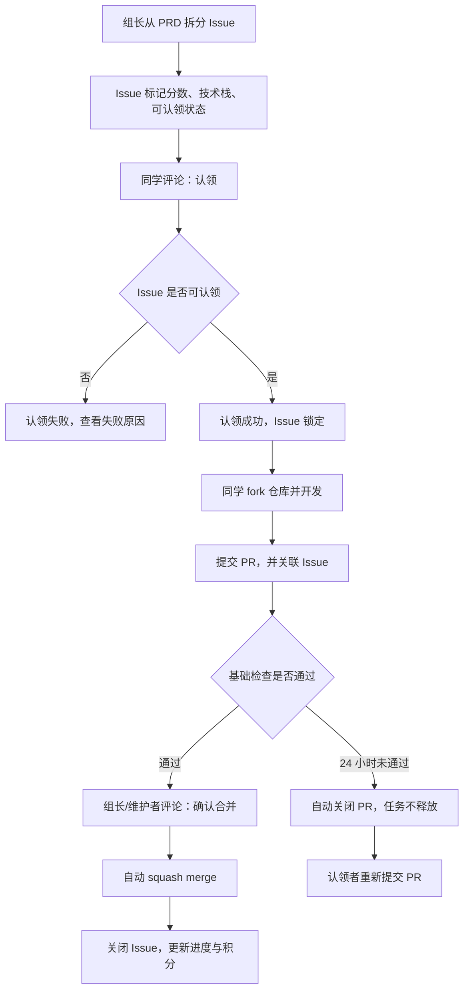

# 规范工作流程

本文用于说明训练营期间的 GitHub 协作规则。所有同学按照这套流程认领任务、开发代码、提交 PR、参与 CR，并通过仓库工作流自动记录进度与积分。

> **阅读摘要**
>
> 每个任务都会以 Issue 的形式发布。同学在 Issue 下评论 `认领` 后，该任务会被锁定到自己名下；同一位同学可以同时认领多个任务，但每个 Issue 同一时间只归一个人负责。开发完成后，从自己的 fork 向主仓库提交 PR，PR 必须关联 Issue。PR 满足基础条件后，只要组长/维护者在最新 commit 后评论 `确认合并`，就会自动合并并计分；如果 PR 24 小时内未合并，会被自动关闭，但任务仍归原认领者负责。

## 一、整体流程



## 二、角色说明

### 组长/维护者

- 从 PRD 拆分任务 Issue。
- 为 Issue 设置任务分数、技术栈和认领状态。
- 处理异常情况，例如任务描述不清、流程异常、工作流失败。
- 可以参与开发，但仍需提 PR，并由组长/维护者确认合并。

### 普通同学

- 通过 Issue 认领任务。
- 从主仓库 fork 后，在自己的 fork 中开发。
- 开发完成后向主仓库提交 PR。
- 可以参与其他同学 PR 的 CR。
- 不能修改主仓库 label。
- 不能直接 push 主仓库 `main` 分支。
- 不能直接修改进度文件。

### GitHub Actions

- 自动处理任务认领。
- 自动检查 PR 是否合规。
- 自动识别可选 CR，用于积分记录。
- 自动合并符合条件且已由组长/维护者确认的 PR。
- 自动关闭 24 小时内未合并的 PR。
- 自动维护进度与积分文件。

### GitHub Copilot

- 仓库通过 GitHub 官方 branch ruleset 开启自动 Copilot code review。
- 所有目标合入分支为 `main` 的 PR 打开时都会自动请求 Copilot review。
- PR 有新 push 时，Copilot 会自动 review 新 push 带来的改动。
- 该规则只看 PR base branch，不限制 head repo，适用于主仓库分支 PR 和 fork 仓库 PR。

## 三、Issue 规则

每个 Issue 对应一个可以独立完成、独立验收的任务。

Issue 通常包含：

- 背景/目标
- 验收标准
- 技术栈要求
- 关联 PRD 章节
- 分数说明

仓库只使用三类任务 label：

- `score:*`：任务分数，例如 `score:1`、`score:2`、`score:3`、`score:5`。
- `stack:*`：技术栈，例如 `stack:react`、`stack:typescript`、`stack:github-actions`。
- `status:*`：认领状态，只使用 `status:open` 和 `status:claimed`。

普通同学不需要、也不能手动修改 label。看到 `status:open` 的 Issue 才可以尝试认领。

## 四、如何认领任务

在想认领的 Issue 下评论：

```text
认领
```

认领成功后，工作流会：

- 将 Issue 从 `status:open` 改为 `status:claimed`。
- 将你设置为 Issue assignee。
- 在进度文件中记录你的当前任务列表。
- 在 Issue 下评论后续开发提示。

认领失败通常有这些原因：

- Issue 已经被其他同学认领。
- Issue 当前不是 `status:open`。
- Issue 缺少任务分数 label。

__**一位同学可以同时认领多个任务。**__ 每个 Issue 仍然只能被一位同学认领；开发时建议每个 Issue 使用独立分支和独立 PR，避免多个任务互相阻塞。

## 五、开发方式

普通同学统一使用 fork 开发：

1. 打开主仓库页面，点击 `Fork`。
2. 在自己的 fork 仓库中基于 `main` 创建新分支。
3. 运行 `npm ci` 安装依赖；该命令会自动安装仓库级 git hooks。
4. 开发前运行 `npm run quality:predev`。
5. 在新分支完成开发。
<!-- 6. 提交前运行 `npm run quality:precommit`。
7. 推送前运行 `npm run quality:local`。 
已经集成入 githooks 中，不用手动运行
-->
6. 向主仓库 `main` 提交 PR。

建议分支命名：

```text
feat/issue-12-record-control
fix/issue-18-player-seek
research/issue-5-editor-selection
```

开发时注意：

- 不要直接修改 `docs/progress.json`。
- 不要直接修改 `docs/progress.md`。
- 不要在 PR 中夹带无关改动。
- 不要用 `SKIP_QUALITY_HOOKS=1` 绕过本地质量闸门，除非维护者明确要求紧急处理。
- 如果任务需求不清楚，先在 Issue 下提问。

## 六、PR 规则

PR 标题建议包含 Issue 编号：

```text
#12 实现录制控制栏
```

PR 正文必须包含：

```text
Closes #12
```

这样 PR 合并后，GitHub 会自动关闭关联 Issue。

PR 必须满足：

- PR author 是该 Issue 的认领者。
- PR 关联的 Issue 处于 `status:claimed`。
- PR 没有修改进度文件。
- 组长/维护者在最新 commit 后评论 `确认合并`。
- `Workflow Tests / quality` 与 `Contract Guard / gitnexus-contract` 基础检查通过。
- PR 在创建后 24 小时内达到可合并状态。

PR 满足条件并获得组长/维护者确认后，工作流会自动执行 squash merge。

## 七、CR 规则

CR 不再是 PR 自动合并的前置条件。PR 只要满足基础检查，并由组长/维护者在最新 commit 后评论 `确认合并`，就可以合并。

同学仍然可以参与 CR；有效 CR 会用于记录 CR 分。没有有效 CR 的 PR 合并后，只记录开发者的开发分，不发放 CR 分。

有效 CR 的要求：

- reviewer 不是 PR author。
- reviewer 不是 bot。
- reviewer 不是 `github-actions[bot]`。
- reviewer 已经认真阅读改动。
- reviewer 是 PR conversation 中第一个有效评论者。
- reviewer 本人评论过精确通过信号。

PR 下首个有效评论者会自动认领该 PR 的 CR，不需要额外评论认领关键词。只有该同学本人在 PR 下评论：

```text
CR通过
```

才会让该同学成为本 PR 的有效 CR reviewer。其他同学即使评论 `CR通过`，也不会越过已认领的 reviewer。

如果 PR 后续又追加 commit，已认领 reviewer 之前评论过的 `CR通过` 仍然有效，不需要重新评论。

`CR通过` 只表示 CR 认可，不会直接触发合并。工作流还需要组长/维护者在 PR 最新 commit 后评论：

```text
确认合并
```

如果 PR 后续又追加 commit，之前的 `确认合并` 会失效，需要组长/维护者重新确认。

CR 时重点看：

- 是否满足 Issue 的验收标准。
- 是否有明显 bug。
- 是否有无关改动。
- 是否存在难以维护的实现。
- 是否缺少必要说明或测试。

CR 同学也会获得该任务分数的一部分，因此 CR 不是走形式。后续如果发现代码质量不合格，开发者和 CR 同学都会被扣分。

## 八、Copilot 自动评审规则

仓库使用 GitHub 官方 branch ruleset 管理 Copilot 自动评审，而不是自定义 workflow 模拟。

Ruleset 要求：

- ruleset 类型：branch ruleset。
- enforcement：Active。
- target branch：default branch / `main`，即 PR 的目标合入分支为 `main`。
- branch rule：Automatically request Copilot code review。
- subsidiary options：开启 `Review new pushes` 和 `Review draft pull requests`。

API 等价配置为：

```json
{
  "type": "copilot_code_review",
  "parameters": {
    "review_on_push": true,
    "review_draft_pull_requests": true
  }
}
```

## 九、24 小时规则

PR 创建后开始计时。

如果 PR 在 24 小时内没有合并，工作流会：

- 自动评论说明超时。
- 自动关闭 PR。
- 如果 PR 使用主仓库分支，该分支会被删除；fork 分支无法由主仓库删除。

__**PR 被关闭不代表任务释放。**__ Issue 仍然保持 `status:claimed`，assignee 不变，进度文件中的当前任务也不清空。

认领者需要继续负责该任务，可以修正后重新提交 PR。新的 PR 会重新开始 24 小时计时。

## 十、计分规则

每个任务都有一个 `score:N` label，表示任务总分。

正常任务合并后：

- 开发者获得 `N * 75%`。
- CR 同学获得 `N * 25%`。

如果多人参与 CR，默认首个有效 PR 评论者获得 CR 分。

进度与积分记录在：

- `docs/progress.json`：机器可读，工作流维护。
- `docs/progress.md`：人类可读，工作流生成。

同学不要手动修改这两个文件。

## 十一、Bug 返工规则

任何同学发现已合并任务存在 bug，都可以新建 bug Issue。

bug Issue 必须写清楚：

- 关联原 Issue。
- 关联原 PR。
- bug 现象。
- 复现步骤。
- 期望行为。

bug Issue 也需要先评论 `认领`，并遵守“每个 Issue 同一时间只归一个人负责”的规则。

bug 修复 PR 合并后：

- 原开发者扣 `N * 150%`。
- 如果原任务有有效 CR，原 CR 同学扣 `N * 50%`。
- 修复开发者获得 `N * 75%`。
- 如果 bug 修复 PR 有有效 CR，修复 CR 同学获得 `N * 25%`。

同一个原任务如果多次发现有效 bug，每个 bug 修复都会独立计算扣分和修复奖励。

## 十二、常见问题

### 我可以直接在主仓库开分支吗？

普通同学不可以。普通同学从 fork 提 PR。组长/维护者保留仓库管理员 bypass 权限，但日常开发仍建议走 PR 和 CR，只有流程修复、紧急配置调整等维护场景才直接 push。

### 我能修改 Issue label 吗？

不可以。label 由组长或工作流维护。同学只需要关注 Issue 描述和当前状态。

### 我认领后发现做不了，怎么办？

在 Issue 下说明原因并联系组长处理。你可以认领新任务，但已认领的任务仍然归你负责，除非组长/维护者释放或重新分配。

### PR 超过 24 小时被关闭后，任务会回到公共池吗？

不会。任务仍然归原认领者负责。修正后重新提 PR。

### CR 只是评论一句就可以吗？

不可以。`CR通过` 表示你已经检查过代码并认可合入。后续如果发现代码质量问题，CR 同学也会承担扣分。

## 十三、最小操作清单

认领任务：

```text
在 Issue 下评论：认领
```

提交 PR：

```text
提交前：npm run quality:precommit
推送前：npm run quality:local
标题：#12 实现录制控制栏
正文：Closes #12
```

完成 CR：

```text
在 PR 下评论问题或建议后，确认通过时评论：CR通过
```

组长/维护者确认合并：

```text
在 PR 最新 commit 后评论：确认合并
```

记住三条底线：

- 一个 Issue 同一时间只归一个人负责。
- PR 必须关联 Issue。
- 不要手动修改 label 和进度文件。
