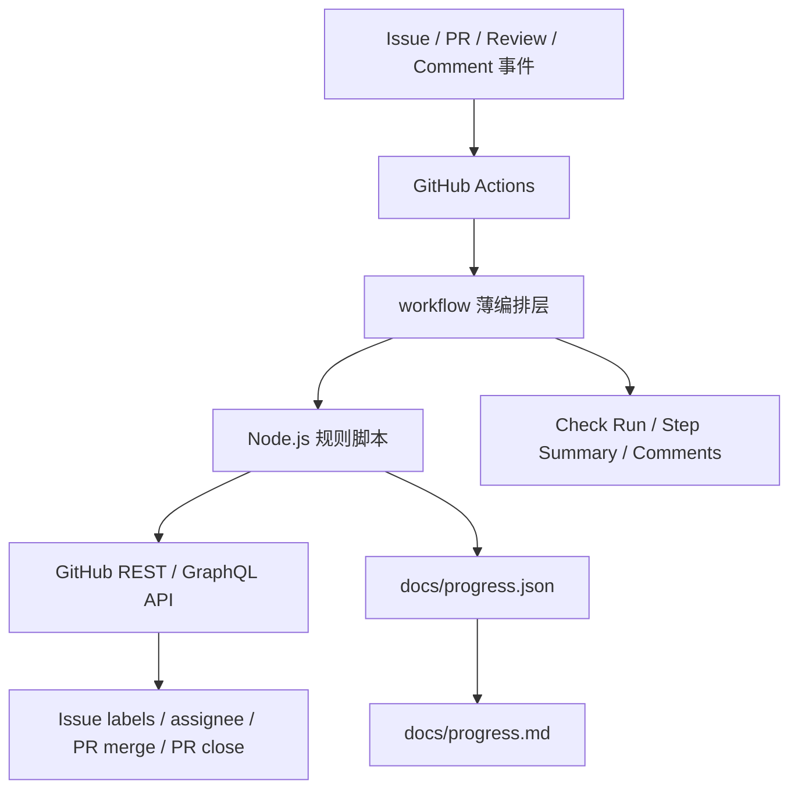

# 规范工作流程自动化技术方案

> **阅读摘要**
>
> 本方案基于 [GitHub 训练营协作流程设计](docs/superpowers/specs/2026-05-21-github-training-workflow-design.md)，将 Issue 认领、PR 合规检查、CR 判定、自动合并、24 小时 PR 关闭、进度与积分维护沉淀为 GitHub Actions 自动化能力。方案采用 GitHub Actions + Node.js 脚本 + 仓库内 JSON 台账的实现方式，普通同学只保留主仓库 `read` 权限，从 fork 提 PR；主仓库状态 label、进度文件和合并动作均由 workflow 收口。最终目标是让训练营流程可执行、可追溯、可治理，同时避免同学通过 label 或台账文件绕过规则。

## 一、背景与目标

训练营协作流程包含三类核心动作：任务发布、任务流转、积分结算。手工维护时，容易出现重复认领、PR 未关联 Issue、CR 走形式、计分不透明等问题。因此需要将规则固化为仓库自动化。

__**本方案的核心目标是让 GitHub 成为唯一协作入口，让 workflow 成为唯一状态写入者。**__

落地后需要满足：

- Issue 通过 `score:*`、`stack:*`、`status:*` 三类 label 管理。
- 普通同学不能修改 label，不能直接 push 主仓库，不能修改进度文件。
- 同学评论 `认领` 后，workflow 自动锁定 Issue。
- 每位同学同一时间只能有一个 active Issue。
- PR 必须由认领者提交，并通过 `Closes #issue` 关联 Issue。
- PR 至少需要一名非作者同学 CR。
- PR 达到条件后自动 squash merge。
- PR 24 小时内未合并时自动关闭，但不释放任务。
- PR 合并后自动关闭 Issue、释放 active Issue、更新积分。
- bug 修复任务合并后自动扣除原开发者和原 CR 同学分数，并奖励修复开发者和修复 CR 同学。

## 二、总体架构



架构分为三层：

- **事件层**：GitHub 触发 `issue_comment`、`pull_request`、`pull_request_review`、`schedule`、`workflow_dispatch` 等事件。
- **规则层**：Node.js 脚本解析事件上下文，执行认领、校验、计分、渲染进度表等规则。
- **状态层**：GitHub Issue/PR 状态与 `docs/progress.json` 共同构成系统状态，`docs/progress.md` 只作为可读视图。

workflow 只做触发和权限编排，复杂逻辑下沉到 `scripts/workflows/*.mjs`。这样可以通过单元测试覆盖规则，避免把大量判断写进 YAML。

## 三、文件结构

建议新增以下文件：

```text
.github/
  CODEOWNERS
  ISSUE_TEMPLATE/
    task.yml
    bug.yml
  PULL_REQUEST_TEMPLATE.md
  workflows/
    labels.yml
    issue-claim.yml
    pr-guard.yml
    pr-auto-merge.yml
    pr-timeout-close.yml
    progress-maintenance.yml

docs/
  progress.json
  progress.md

scripts/
  workflows/
    config.mjs
    github-client.mjs
    progress-store.mjs
    render-progress.mjs
    issue-parser.mjs
    pr-parser.mjs
    claim-issue.mjs
    guard-pr.mjs
    auto-merge-pr.mjs
    timeout-close-prs.mjs
    apply-merge-score.mjs
    apply-bug-score.mjs
  tests/
    progress-store.test.mjs
    scoring.test.mjs
    issue-parser.test.mjs
    pr-parser.test.mjs
```

职责划分：

| 文件/目录 | 职责 |
| --- | --- |
| `.github/CODEOWNERS` | 声明进度文件、workflow、脚本由维护者负责 |
| `.github/ISSUE_TEMPLATE/task.yml` | 普通任务 Issue 表单 |
| `.github/ISSUE_TEMPLATE/bug.yml` | bug 返工 Issue 表单 |
| `.github/PULL_REQUEST_TEMPLATE.md` | 强制提醒填写 `Closes #issue` 和 CR 信息 |
| `.github/workflows/*.yml` | GitHub 事件触发、权限设置、脚本调用 |
| `docs/progress.json` | 机器可读台账，唯一积分数据源 |
| `docs/progress.md` | 人类可读进度表，由脚本生成 |
| `scripts/workflows/*.mjs` | 规则实现 |
| `scripts/tests/*.test.mjs` | Node.js 内置测试，覆盖核心规则 |

## 四、权限与分支保护

### 仓库权限

普通同学在主仓库只授予 `read` 权限。这样同学可以查看仓库、开 Issue、评论、从 fork 提 PR、参与 review，但不能修改主仓库 label。

组长/维护者保留管理权限。由于 GitHub owner/admin 无法被完全技术限制，维护者属于可信角色。

### workflow 权限

不同 workflow 使用最小权限：

| workflow | permissions |
| --- | --- |
| `labels.yml` | `issues: write` |
| `issue-claim.yml` | `contents: write`, `issues: write` |
| `pr-guard.yml` | `contents: read`, `pull-requests: write`, `issues: read` |
| `pr-auto-merge.yml` | `contents: write`, `pull-requests: write`, `issues: write` |
| `pr-timeout-close.yml` | `contents: write`, `pull-requests: write`, `issues: write` |
| `progress-maintenance.yml` | `contents: write`, `pull-requests: read`, `issues: write` |

`contents: write` 只用于 workflow 更新 `docs/progress.json` 和 `docs/progress.md`，普通 PR 修改这两个文件必须被 `pr-guard` 拦截。

### 主分支保护

`main` 分支启用：

- 禁止普通同学直接 push。
- 不启用 “Do not allow bypassing the above settings”，组长/仓库管理员保留直接 push / bypass 权限。
- 必须通过 PR 合并。
- 必须通过 `pr-guard` 检查。
- 只允许 squash merge。
- 自动删除已合并的主仓库分支。

不依赖 GitHub 原生 required approving reviews 作为唯一门禁。由于普通同学只有 `read` 权限，CR 门禁由 workflow 读取 review/comment 后自行判断。

## 五、数据模型

### progress.json

`docs/progress.json` 是唯一积分台账。建议初始结构：

```json
{
  "version": 1,
  "updatedAt": null,
  "students": {},
  "issues": {},
  "ledger": []
}
```

学生结构：

```json
{
  "activeIssue": null,
  "completedIssues": [],
  "reviewedIssues": [],
  "bugPenalties": [],
  "developmentScore": 0,
  "reviewScore": 0,
  "penaltyScore": 0,
  "totalScore": 0
}
```

Issue 结构：

```json
{
  "number": 12,
  "title": "实现录制控制栏",
  "score": 5,
  "stack": ["react", "typescript"],
  "status": "claimed",
  "assignee": "alice",
  "claimedAt": "2026-05-22T10:00:00.000Z",
  "closedAt": null,
  "mergedPr": null
}
```

流水结构：

```json
{
  "id": "pr-34-merge",
  "type": "feature_merge",
  "issue": 12,
  "pr": 34,
  "score": 5,
  "developer": "alice",
  "reviewer": "bob",
  "developerDelta": 3.75,
  "reviewerDelta": 1.25,
  "createdAt": "2026-05-22T12:00:00.000Z"
}
```

bug 扣分流水结构：

```json
{
  "id": "bug-41-fix-pr-45",
  "type": "bug_fix_merge",
  "sourceIssue": 12,
  "sourcePr": 34,
  "bugIssue": 41,
  "fixPr": 45,
  "score": 5,
  "originalDeveloper": "alice",
  "originalReviewer": "bob",
  "fixDeveloper": "carol",
  "fixReviewer": "dave",
  "originalDeveloperDelta": -7.5,
  "originalReviewerDelta": -2.5,
  "fixDeveloperDelta": 3.75,
  "fixReviewerDelta": 1.25,
  "createdAt": "2026-05-22T18:00:00.000Z"
}
```

### 幂等性

所有流水必须具备稳定 `id`。写入前先检查 `ledger` 是否已有同 ID，避免 workflow 重跑导致重复计分。

分数统一保留两位小数。计算时使用整数基点也可以，例如将 1 分表示为 100 point，渲染时再除以 100，避免浮点误差。

## 六、Label 与模板初始化

### labels.yml

`labels.yml` 使用 `workflow_dispatch` 手动触发，负责创建或更新标准 label：

- `score:1`
- `score:2`
- `score:3`
- `score:5`
- `score:8`
- `stack:react`
- `stack:typescript`
- `stack:node`
- `stack:github-actions`
- `stack:research`
- `status:open`
- `status:claimed`

该 workflow 不在 PR 或 Issue 事件中自动运行，避免意外覆盖维护者临时调整。

### Issue 模板

普通任务模板字段：

- 背景/目标
- 验收标准
- 技术栈要求
- 关联 PRD 章节
- 分数说明

bug 模板字段：

- 关联原 Issue
- 关联原 PR
- bug 现象
- 复现步骤
- 期望行为

模板本身不写 label。label 由组长创建 Issue 后设置，或由初始化脚本辅助维护。

## 七、认领流程设计

### 触发条件

`issue-claim.yml` 监听：

```yaml
on:
  issue_comment:
    types: [created]
```

只有满足以下条件才执行：

- 评论内容精确等于 `认领`。
- 评论所在对象是 Issue，不是 PR。
- 评论者不是 bot。

### 核心流程

`claim-issue.mjs` 执行：

1. 读取 Issue labels。
2. 校验 Issue 带有 `status:open`。
3. 校验 Issue 有且仅有一个 `score:*`。
4. 读取 `docs/progress.json`。
5. 检查评论者是否已有 `activeIssue`。
6. 检查 Issue 是否已在 `progress.issues` 中被认领。
7. 将 `status:open` 替换为 `status:claimed`。
8. 将评论者设置为 Issue assignee。
9. 写入 `progress.students[username].activeIssue`。
10. 写入 `progress.issues[issueNumber]`。
11. 重新生成 `docs/progress.md`。
12. commit 进度文件。
13. 在 Issue 下评论认领结果。

失败时不修改状态，只评论失败原因。

### 并发控制

认领 workflow 可能出现两个同学几乎同时评论的情况。处理策略：

- workflow 使用 `concurrency.group: claim-issue-${{ github.event.issue.number }}`，同一个 Issue 串行执行。
- 写入前重新读取最新 Issue labels 和 `progress.json`。
- 以 GitHub Issue label 和 `progress.json` 双重状态为准。

## 八、PR Guard 设计

### 触发条件

`pr-guard.yml` 监听：

- `pull_request`：`opened`、`edited`、`synchronize`、`reopened`、`ready_for_review`
- `pull_request_review`：`submitted`
- `issue_comment`：`created`，用于识别 `CR通过`

### 检查项

`guard-pr.mjs` 输出一个 check 结果，包含：

| 检查项 | 规则 |
| --- | --- |
| 关联 Issue | PR body 必须包含 `Closes #N` |
| Issue 状态 | 关联 Issue 必须是 `status:claimed` |
| 作者一致 | PR author 必须等于 Issue assignee / progress active owner |
| 台账保护 | PR diff 不能修改 `docs/progress.json`、`docs/progress.md` |
| CR 有效 | 至少一名非作者 reviewer approve 或评论 `CR通过` |
| 24 小时 | PR 创建时间距离当前不超过 24 小时 |
| 基础检查 | repo-guard 等已有检查需要通过 |

PR guard 不直接合并，只负责给出可机读结论。建议在 PR comment 或 step summary 中输出未通过原因，便于同学修复。

### 关联 Issue 解析

只接受 PR body 中的关闭关键字：

```text
Closes #12
Fixes #12
Resolves #12
```

如果同一个 PR 关联多个 Issue，guard 失败。训练营流程要求一个 PR 对应一个任务 Issue，避免计分歧义。

## 九、CR 判定设计

优先读取 GitHub PR review：

- `state === "APPROVED"`
- `user.login !== pr.user.login`
- `user.type !== "Bot"`

如果普通同学无法提交可识别 approve，则支持 PR 下评论：

```text
CR通过
```

评论式 CR 需要满足：

- 评论者不是 PR author。
- 评论者不是 bot。
- 评论位于 PR conversation，而不是普通 Issue。
- 评论时间晚于 PR 最近一次 commit 时间。

如果 PR 在 CR 后又 push 了新 commit，原 CR 失效，需要重新 approve 或重新评论 `CR通过`。

多人 CR 时，计分 reviewer 取最早有效 CR。同一 PR 只给一名 CR 同学计分。

## 十、自动合并设计

### 触发条件

`pr-auto-merge.yml` 在以下事件后运行：

- `workflow_run`：`pr-guard.yml` 成功后。
- 或复用 `pull_request_review` / `issue_comment` 触发后再次调用 guard。

推荐第一期采用简单实现：`pr-auto-merge.yml` 直接复用 `guard-pr.mjs --require-pass`，通过后执行合并。

### 合并动作

`auto-merge-pr.mjs` 执行：

1. 确认 PR 仍然 open。
2. 重新执行 guard，避免状态过期。
3. 调用 GitHub API 执行 squash merge。
4. 使用固定 commit title：`#<issue> <pr-title>`。
5. 如果是主仓库分支，合并后删除分支。

合并成功后，GitHub 会通过 `Closes #N` 自动关闭 Issue。后续积分由 `progress-maintenance.yml` 处理。

## 十一、24 小时 PR 关闭设计

### 触发条件

`pr-timeout-close.yml` 使用定时任务：

```yaml
on:
  schedule:
    - cron: "*/30 * * * *"
  workflow_dispatch:
```

每 30 分钟扫描一次 open PR。

### 关闭规则

对每个 open PR：

1. PR 创建时间超过 24 小时。
2. PR 仍未合并。
3. PR 关联一个 claimed Issue。
4. PR author 是该 Issue 的认领者。

满足后：

- 评论说明 PR 已超时关闭。
- 关闭 PR。
- 如果 PR head repo 是主仓库，删除 head branch。
- __**不修改 Issue label。**__
- __**不清空 assignee。**__
- __**不清空 `progress.students[author].activeIssue`。**__

认领者可以继续负责该任务并重新提交 PR。新 PR 重新开始 24 小时计时。

## 十二、合并后计分设计

### 触发条件

`progress-maintenance.yml` 监听：

```yaml
on:
  pull_request:
    types: [closed]
```

仅当 `pull_request.merged == true` 时执行。

### 普通任务计分

`apply-merge-score.mjs` 执行：

1. 解析 PR body 中的 Issue 编号。
2. 读取 Issue 的 `score:N` label。
3. 读取有效 CR reviewer。
4. 判断是否为 bug Issue。
5. 对普通任务写入 `feature_merge` 流水：
   - developer delta = `N * 0.75`
   - reviewer delta = `N * 0.25`
6. 更新开发者：
   - 追加 `completedIssues`
   - 增加 `developmentScore`
   - 清空 `activeIssue`
7. 更新 reviewer：
   - 追加 `reviewedIssues`
   - 增加 `reviewScore`
8. 更新 Issue：
   - `status = "closed"`
   - `closedAt`
   - `mergedPr`
9. 移除 Issue 的 `status:claimed`。
10. 生成 `docs/progress.md`。
11. commit 台账文件。

由于 PR body 使用 `Closes #N`，GitHub 会关闭 Issue。workflow 只需确保 label 和 progress 状态同步。

### bug 任务计分

bug Issue 通过正文解析原 Issue 与原 PR：

```text
关联原 Issue: #12
关联原 PR: #34
```

`apply-bug-score.mjs` 执行：

1. 找到原 Issue 的完成流水。
2. 取原开发者和原 CR。
3. 读取 bug Issue 的 `score:N`。
4. 找到 bug 修复 PR 的开发者和 CR。
5. 写入 `bug_fix_merge` 流水：
   - 原开发者 delta = `-N * 1.5`
   - 原 CR delta = `-N * 0.5`
   - 修复开发者 delta = `N * 0.75`
   - 修复 CR delta = `N * 0.25`
6. 更新四位同学的聚合分数。
7. 清空修复开发者 active Issue。
8. 更新 bug Issue 状态。
9. 生成 `docs/progress.md`。
10. commit 台账文件。

如果原 Issue 没有完成流水，bug 计分失败，并在 PR 下评论原因。这样可以避免把调研 Issue 或未纳入流程的历史 Issue 错误扣分。

## 十三、progress.md 渲染

`render-progress.mjs` 从 `progress.json` 生成 Markdown，建议包含三段：

### 当前任务

| GitHub 用户 | 当前 Issue | 认领时间 |
| --- | --- | --- |
| alice | #12 实现录制控制栏 | 2026-05-22 10:00 |

### 积分总览

| GitHub 用户 | 开发分 | CR 分 | 扣分 | 总分 |
| --- | ---: | ---: | ---: | ---: |
| alice | 12.75 | 2.50 | -7.50 | 7.75 |

### 最近流水

| 时间 | 类型 | Issue | PR | 变更 |
| --- | --- | --- | --- | --- |
| 2026-05-22 12:00 | feature_merge | #12 | #34 | alice +3.75, bob +1.25 |

`progress.md` 顶部注明：

```text
本文件由 GitHub Actions 自动生成，请勿手动修改。
```

## 十四、受保护文件检查

`pr-guard.yml` 必须检查 PR diff。只要普通 PR 修改以下文件，guard 失败：

- `docs/progress.json`
- `docs/progress.md`

workflow 自己提交台账文件时，commit author 使用固定 bot 身份，例如：

```text
github-actions[bot] <github-actions[bot]@users.noreply.github.com>
```

同时 `.github/CODEOWNERS` 标记：

```text
docs/progress.json @maintainer
docs/progress.md @maintainer
.github/workflows/ @maintainer
scripts/workflows/ @maintainer
```

`@maintainer` 需要替换为实际维护者 GitHub 用户名或团队名。

## 十五、与现有 repo-guard 的关系

当前仓库已有 `.github/workflows/repo-guard.yml`。该 workflow 负责 AI 代码审查或仓库守卫，不直接承担训练营流程状态机。

新 workflow 与 repo-guard 的关系：

- `repo-guard.yml` 继续作为基础检查。
- `pr-guard.yml` 负责训练营流程规则。
- `pr-auto-merge.yml` 在合并前需要确认 `repo-guard` 和 `pr-guard` 都通过。

如果 repo-guard 只对同仓库 PR 生效，fork PR 的基础检查需要额外确认。训练营自动合并不能只依赖 repo-guard，必须至少通过 `pr-guard`。

## 十六、测试策略

### 单元测试

使用 Node.js 内置 `node:test`，不引入额外依赖。

重点覆盖：

- `score:5` 解析为 5。
- 缺少 `score:*` 时认领失败。
- 多个 `score:*` 时认领失败。
- 用户已有 active Issue 时认领失败。
- PR body 无 `Closes #N` 时 guard 失败。
- PR body 关联多个 Issue 时 guard 失败。
- PR author 与 assignee 不一致时 guard 失败。
- 修改 `docs/progress.json` 时 guard 失败。
- CR 评论早于最新 commit 时无效。
- 正常任务按 75% / 25% 计分。
- bug 修复按 -150% / -50% / +75% / +25% 计分。
- 同一流水重复执行不会重复计分。
- 超时 PR 关闭时不释放 Issue，不清空 active Issue。

### workflow dry run

在正式启用前，提供 `workflow_dispatch` dry-run 参数：

```yaml
inputs:
  dryRun:
    description: "只输出计划动作，不写入 GitHub 状态"
    required: true
    default: "true"
```

dry-run 输出即将修改的 label、assignee、progress diff 和评论内容，维护者确认后再关闭 dry-run。

## 十七、落地阶段

### 阶段一：基础设施

- 创建 Issue 模板、PR 模板、CODEOWNERS。
- 创建 `docs/progress.json` 和 `docs/progress.md` 初始文件。
- 创建 label 初始化 workflow。
- 创建进度渲染脚本和单元测试。

### 阶段二：认领闭环

- 实现 `issue-claim.yml`。
- 实现 `claim-issue.mjs`。
- 支持认领成功、认领失败、重复认领、并发认领。
- 验证“一人一个 active Issue”。

### 阶段三：PR 检查与 CR

- 实现 `pr-guard.yml`。
- 实现 PR body 解析、受保护文件检查、author/assignee 检查。
- 实现 approve 与 `CR通过` 双通道 CR 判定。
- 接入 repo-guard 状态检查。

### 阶段四：自动合并与超时关闭

- 实现 `pr-auto-merge.yml`。
- 实现 squash merge。
- 实现主仓库分支删除。
- 实现 `pr-timeout-close.yml`。
- 验证超时只关闭 PR，不释放任务。

### 阶段五：积分与 bug 返工

- 实现普通任务合并计分。
- 实现 bug 修复计分与扣分。
- 实现流水幂等。
- 渲染 `docs/progress.md`。
- 进行一次端到端演练。

## 十八、验收标准

| 场景 | 预期结果 |
| --- | --- |
| 同学评论 `认领` 一个 open Issue | Issue 变为 claimed，assignee 设置成功，progress 记录 active Issue |
| 同学已有 active Issue 再认领 | 认领失败，Issue 状态不变 |
| PR 未写 `Closes #N` | PR guard 失败 |
| PR author 不是认领者 | PR guard 失败 |
| PR 修改 progress 文件 | PR guard 失败 |
| 非作者同学 approve | PR guard 识别有效 CR |
| PR 通过所有检查 | workflow 自动 squash merge |
| PR 超过 24 小时未合并 | PR 被关闭，Issue 仍保持 claimed，active Issue 不清空 |
| 普通任务合并 | 开发者 +75%，CR +25%，Issue 关闭 |
| bug 修复合并 | 原开发者 -150%，原 CR -50%，修复开发者 +75%，修复 CR +25% |
| workflow 重跑 | 不重复写入同一条 ledger |

## 十九、风险与应对

| 风险 | 影响 | 应对 |
| --- | --- | --- |
| `GITHUB_TOKEN` 无法触发后续 workflow | 台账 commit 后不触发其他流程 | 合并后计分集中在同一 workflow 内完成，避免依赖链式触发 |
| fork PR 权限受限 | workflow 对 fork PR 写入能力不足 | 对 PR guard 使用只读检查，状态写入放在主仓库事件或维护者 token 中执行 |
| CR 评论被滥用 | 未认真 review 也能通过 | 通过扣分机制约束；后续可加入最小评论长度或 checklist |
| 并发认领 | 同一 Issue 被多人抢占 | 使用 concurrency 串行化，写入前二次读取状态 |
| 小数分出现误差 | 总分展示异常 | 内部用整数 point 计算，渲染时保留两位 |
| 维护者误改台账 | 台账不可信 | CODEOWNERS + 分支保护 + ledger 可追溯；维护者仍是可信角色 |

## 二十、配置清单

上线前需要组长确认：

- 普通同学在主仓库只有 `read` 权限。
- `main` 禁止普通同学直接 push，组长/仓库管理员保留 bypass 权限。
- PR 只允许 squash merge。
- required check 至少包含 `pr-guard`。
- 已创建 `score:*`、`stack:*`、`status:*` label。
- `docs/progress.json` 和 `docs/progress.md` 已初始化。
- `@maintainer` 已替换为真实维护者。
- repo-guard 与训练营 workflow 的触发条件不存在冲突。

完成以上配置后，训练营流程即可从“人工约定”演进为“仓库自动治理”。
